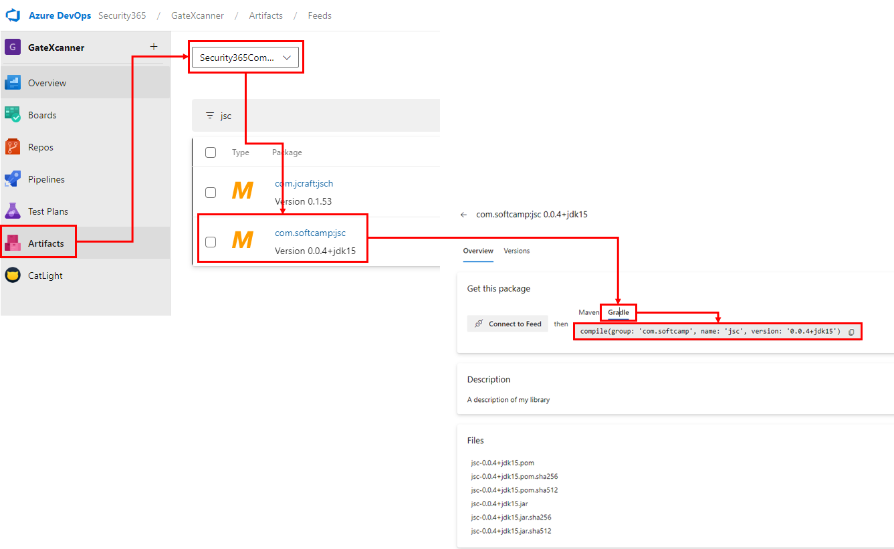
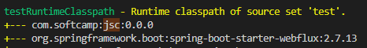
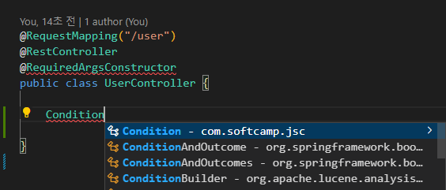
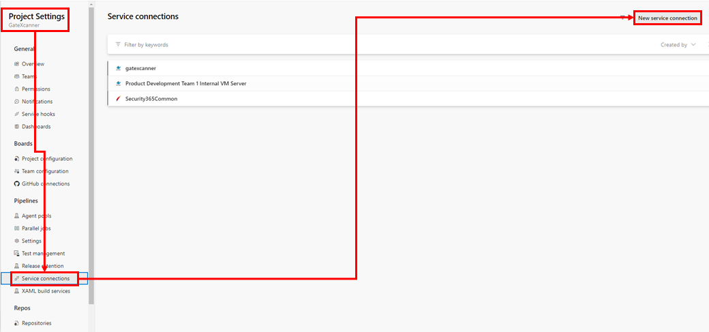
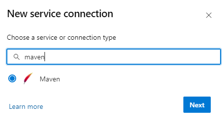
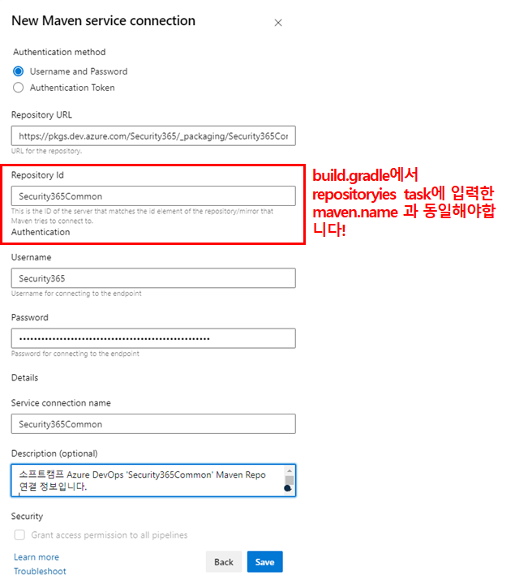

<!-- TOC -->

- [azure devops build pipeline을 활용하여 공용 라이브러리 가져와 사용하는 방법 (for Gradle)](#azure-devops-build-pipeline을-활용하여-공용-라이브러리-가져와-사용하는-방법-for-gradle)
  - [프로젝트의 build.gradle 수정](#프로젝트의-buildgradle-수정)
    - [settings.xml 과의 연동을 위한 플러그인 'net.linguica.maven-settings' 등록](#settingsxml-과의-연동을-위한-플러그인-netlinguicamaven-settings-등록)
    - [repositories task에 maven repository 정보 추가](#repositories-task에-maven-repository-정보-추가)
    - [dependencies 에 사용할 라이브러리 추가](#dependencies-에-사용할-라이브러리-추가)
    - [개발 환경의 settings.xml 수정](#개발-환경의-settingsxml-수정)
    - [라이브러리 사용 가능 여부 확인](#라이브러리-사용-가능-여부-확인)
  - [azure devops build 환경 구축](#azure-devops-build-환경-구축)
    - [service connections 추가](#service-connections-추가)
    - [build pipeline 작성 (또는 수정)](#build-pipeline-작성-또는-수정)
  - [끝으로](#끝으로)

<!-- /TOC -->

# azure devops build pipeline을 활용하여 공용 라이브러리 가져와 사용하는 방법 (for Gradle)

java gradle 프로젝트에서 private maven repo 로 부터 라이브러리를 다운받는 방법을 작성해 보았습니다.

---

## 프로젝트의 build.gradle 수정

의존성 명시 및 /.m2/Settings.xml과의 호환을 도와주는 플러그인 사용 등을 위하여 build.gradle 수정이 필요합니다.

</br>

### settings.xml 과의 연동을 위한 플러그인 'net.linguica.maven-settings' 등록

gradle 의 경우 gradle.properties 라는 파일을 참조하기 때문에 일반적으로는 **settings.xml** 을 사용하지 않습니다.

하지만, azure devops의 build pipeline에서는 이 **gradle.properties** 를 생성해주는 **task** 가 별도로 없고 **settings.xml** 을 만들어주는 **task**는 존재하기 때문에 호환성을 위하여 플러그인을 사용합니다.

해당 플러그인의 자세한 정보는 [깃허브](https://github.com/mark-vieira/gradle-maven-settings-plugin)에서 확인할 수 있습니다.

```groovy
plugins {
    id 'net.linguica.maven-settings' version '0.5' // USER-HOME/.m2/settings.xml에서 maven repo 로그인 정보를 얻고자 사용한 플러그인
    // ...
}
```

</br>

### repositories task에 maven repository 정보 추가

private maven repository를 사용하기 위하여 **repositories** task에 정보를 추가해야합니다.

**private** 이기 때문에 인증 정보를 필요로 하는데 이 **인증 정보는 settings.xml에 명시하고** 이를 가져다 쓰는 방식으로 사용하게 됩니다.

일반적으로는 불가능하며 플러그인의 도움을 받아야합니다.

```groovy
repositories { 
    mavenCentral()
    maven {
        name = 'Security365Common' // USER-HOME/.m2/settings.xml 의 server.id 에 해당하는 섹션의 인증 정보를 참조합니다
        url = 'https://pkgs.dev.azure.com/Security365/_packaging/Security365Common/maven/v1/'
    }
}
```

- `name` : settings.xml에 명시된 server.id 의 값
- `url` : maven repository 경로

> **잠깐! url 정보도 settings.xml에 명시해서 자동으로는 못 가져다 쓰나?**
> 안타깝게 repositories 에 추가한 maven() 자체가 url 을 필수로 명시해야하며 플러그인에서 매핑되는 **id** 로 부터 url을 가져오는 기능은 없는걸로 보입니다.

</br>

### dependencies 에 사용할 라이브러리 추가

자 이제 `Security365Common` 에서 사용할 라이브러리를 검색하여 의존성에 추가해줍니다.

  

> **잠깐!** 사용하는 gradle 버전에 따라 compile()을 사용하지 못할 수 있습니다! 그럴 경우 implementation() 등을 사용해주세요

위와 같이 사용할 라이브러리를 찾고 아래와 같이 dependencies 에 추가해줍니다

```groovy
dependencies {
    implementation 'com.softcamp:jsc:0.0.4+jdk15'
    // ...
}
```

</br>

### 개발 환경의 settings.xml 수정

pipeline을 통한 build와 별개로 개발하는 환경에서 라이브러리를 받을 수 있어야 개발이 가능하기에 수동으로 **settings.xml** 에 **maven repository**의 정보를 입력해 놓습니다.

경로는 **USER-HOME/.m2/settings.xml** 입니다.

```xml

<settings xmlns="http://maven.apache.org/SETTINGS/1.0.0"
    xmlns:xsi="http://www.w3.org/2001/XMLSchema-instance"
    xsi:schemaLocation="http://maven.apache.org/SETTINGS/1.0.0 https://maven.apache.org/xsd/settings-1.0.0.xsd">
    <servers>
        <server>
            <id>Security365Common</id>
            <username>Security365</username>
            <password> PAT 또는 패스워드 </password>
        </server>
    </servers>
</settings>

```

</br>

### 라이브러리 사용 가능 여부 확인

라이브러리가 정상적으로 다운로드 되었으면 `gradlew dependencies` 명령어를 통해 확인할 수 있으며

  

또는 `패키지` 가 인식되는지 간단하게 코드를 통해서 확인도 가능합니다.

  

---

</br>

## azure devops build 환경 구축

### service connections 추가

라이브러리를 다운받을 maven repository의 정보를 **service connections** 에 미리 등록해야합니다.

  

**New service connection** 버튼을 클릭하면 검색창이 생성되는데 **maven** 으로 검색한 후 **라디오 버튼을 클릭하여 선택한 후 Next 버튼**으로 다음 단계로 넘어갑니다.

  

다음 단계에서 **연결 정보** 를 입력하게 되는데 이때 중요한 것은 **Repository Id** 가 build.gradle에서 reposiotryies task에 입력한 maven.name의 값과 동일해야합니다!

  

</br>

### build pipeline 작성 (또는 수정)

자 이제 build pipeline을 작성하거나 이미 존재할 경우 수정을 해줘야하는데

`MavenAuthenticate@0` 라는 미리 정의된 Task를 사용해야합니다.

해당 Task는 **service connections** 에 등록된 MavenRepository 인증 정보를 **USER-HOME/.m2/settings.xml** 에 등록합니다.

더 자세한 정보는 [MavenAuthenticate@0 - Maven 인증 v0 작업](https://learn.microsoft.com/ko-kr/azure/devops/pipelines/tasks/reference/maven-authenticate-v0?view=azure-pipelines) 를 참고해주시기 바랍니다.

```xml
  - task: MavenAuthenticate@0
    inputs:
        artifactsFeeds: "Security365Common"
        mavenServiceConnections: "Security365Common"
```

- `artifactsFeeds` : Maven을 사용하여 인증할 Azure Artifacts 피드 이름의 쉼표로 구분된 목록을 지정합니다. 외부 Maven 리포지토리에 대한 인증만 필요한 경우 이 필드를 비워 둡니다.
- `mavenServiceConnections` : Maven을 사용하여 인증할 외부 조직의 Maven 서비스 연결 이름 목록을 쉼표로 구분하여 지정합니다. Azure Artifacts 피드에 대한 인증만 필요한 경우 이 필드를 비워 둡니다.

---

## 끝으로

오타나 내용이 이상한 경우 **신우섭(wusub.shin@softcamp.co.kr)** 로 연락 주시면 수정하도록 하겠습니다 감사합니다