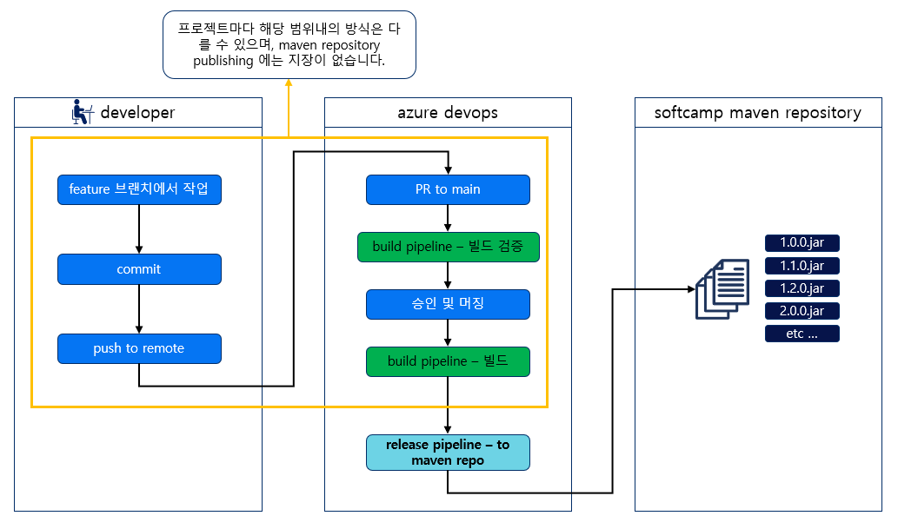
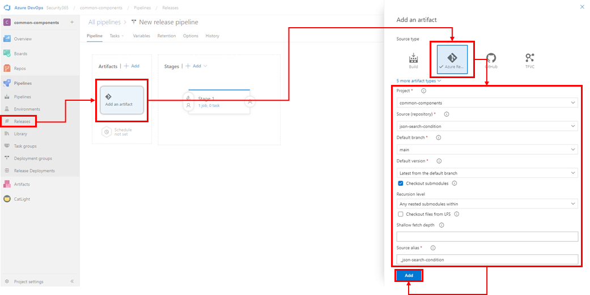
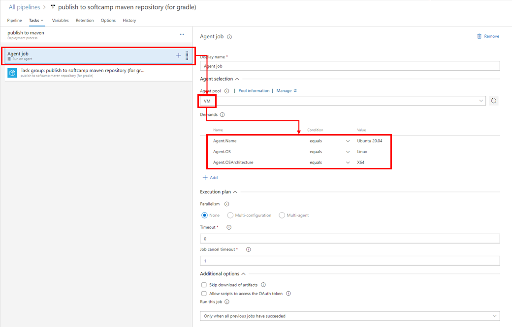
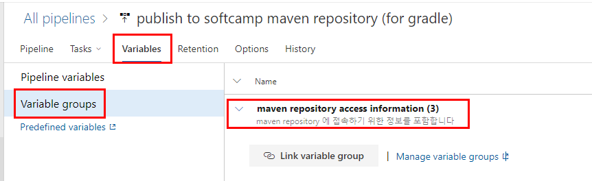
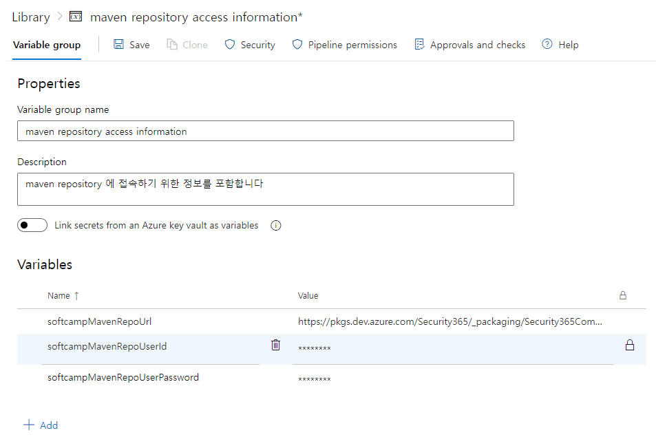
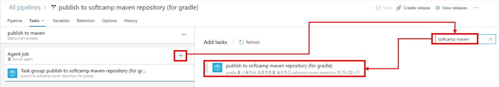
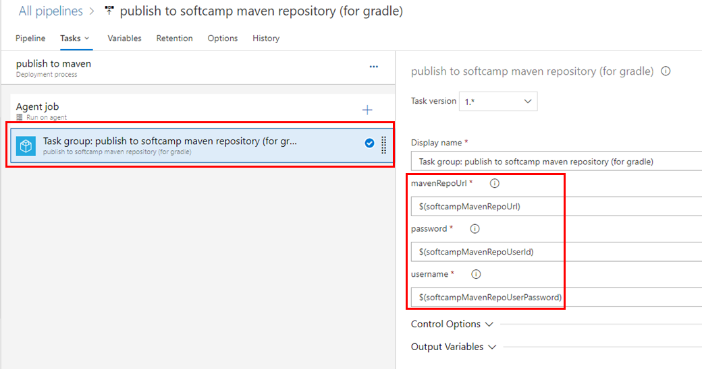
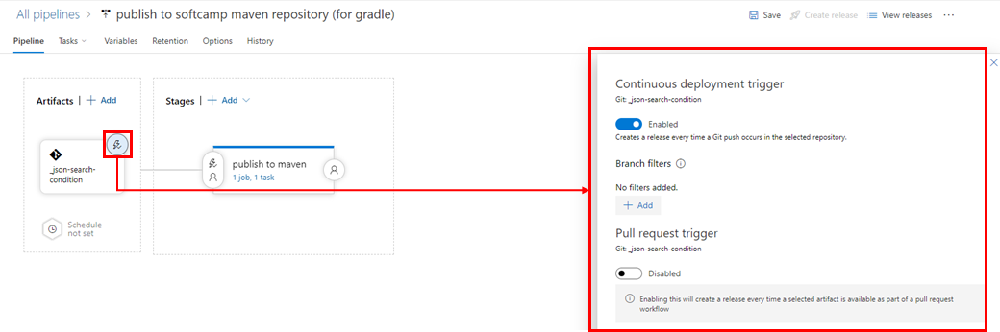
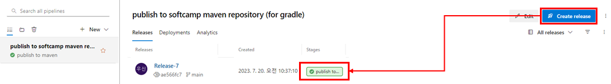
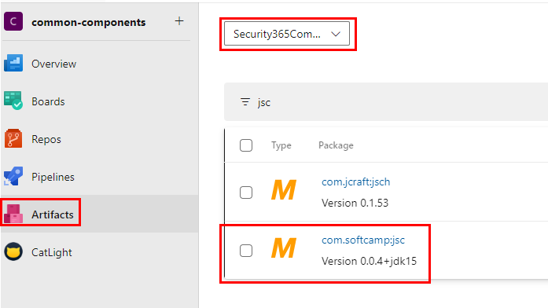

<!-- TOC -->

- [azure devops release pipeline을 활용하여 공용 라이브러리 게시하는 방법 for Gradle](#azure-devops-release-pipeline%EC%9D%84-%ED%99%9C%EC%9A%A9%ED%95%98%EC%97%AC-%EA%B3%B5%EC%9A%A9-%EB%9D%BC%EC%9D%B4%EB%B8%8C%EB%9F%AC%EB%A6%AC-%EA%B2%8C%EC%8B%9C%ED%95%98%EB%8A%94-%EB%B0%A9%EB%B2%95-for-gradle)
    - [라이브러리 프로젝트의 build.gradle 수정](#%EB%9D%BC%EC%9D%B4%EB%B8%8C%EB%9F%AC%EB%A6%AC-%ED%94%84%EB%A1%9C%EC%A0%9D%ED%8A%B8%EC%9D%98-buildgradle-%EC%88%98%EC%A0%95)
        - [maven-publish 플러그인 추가](#maven-publish-%ED%94%8C%EB%9F%AC%EA%B7%B8%EC%9D%B8-%EC%B6%94%EA%B0%80)
        - [shadowJar 플러그인 추가 optional](#shadowjar-%ED%94%8C%EB%9F%AC%EA%B7%B8%EC%9D%B8-%EC%B6%94%EA%B0%80-optional)
        - [shadowJar Task 정의 optional](#shadowjar-task-%EC%A0%95%EC%9D%98-optional)
        - [publishing Task 정의](#publishing-task-%EC%A0%95%EC%9D%98)
            - [구역 1 : maven repo 인증을 위한 변수 값 셋팅](#%EA%B5%AC%EC%97%AD-1--maven-repo-%EC%9D%B8%EC%A6%9D%EC%9D%84-%EC%9C%84%ED%95%9C-%EB%B3%80%EC%88%98-%EA%B0%92-%EC%85%8B%ED%8C%85)
            - [구역 2 : publishing 될 결과물에 대한 정보를 정의하는 task](#%EA%B5%AC%EC%97%AD-2--publishing-%EB%90%A0-%EA%B2%B0%EA%B3%BC%EB%AC%BC%EC%97%90-%EB%8C%80%ED%95%9C-%EC%A0%95%EB%B3%B4%EB%A5%BC-%EC%A0%95%EC%9D%98%ED%95%98%EB%8A%94-task)
            - [구역 3 : maven repository 정보 및 인증을 위한 task](#%EA%B5%AC%EC%97%AD-3--maven-repository-%EC%A0%95%EB%B3%B4-%EB%B0%8F-%EC%9D%B8%EC%A6%9D%EC%9D%84-%EC%9C%84%ED%95%9C-task)
    - [azure release pipeline 을 통한 maven repository에 publish 하기](#azure-release-pipeline-%EC%9D%84-%ED%86%B5%ED%95%9C-maven-repository%EC%97%90-publish-%ED%95%98%EA%B8%B0)
        - [순서도](#%EC%88%9C%EC%84%9C%EB%8F%84)
        - [Azure devops release pipeline 추가](#azure-devops-release-pipeline-%EC%B6%94%EA%B0%80)
            - [Agent Job 선택](#agent-job-%EC%84%A0%ED%83%9D)
            - [Variables 추가 Optional](#variables-%EC%B6%94%EA%B0%80-optional)
            - [Task 추가](#task-%EC%B6%94%EA%B0%80)
        - [트리깅 방식 선택 Optional](#%ED%8A%B8%EB%A6%AC%EA%B9%85-%EB%B0%A9%EC%8B%9D-%EC%84%A0%ED%83%9D-optional)
        - [publish 테스트](#publish-%ED%85%8C%EC%8A%A4%ED%8A%B8)
        - [publish 결과 확인](#publish-%EA%B2%B0%EA%B3%BC-%ED%99%95%EC%9D%B8)
    - [끝으로](#%EB%81%9D%EC%9C%BC%EB%A1%9C)

<!-- /TOC -->

# azure devops release pipeline을 활용하여 공용 라이브러리 게시하는 방법 (for Gradle)

java gradle 프로젝트로 만들어진 라이브러리를 azure devops release pipeline 를 통하여 게시하는 방법을 작성해 보았습니다.

---

## 라이브러리 프로젝트의 build.gradle 수정

게시를 위한 공식 플러그인 사용 및 기타 기능을 위해서 build.gradle 를 수정해야합니다.

### maven-publish 플러그인 추가

```groovy
plugins {
    id 'maven-publish'
    // ...
}
```

위와 같이 **maven-publish** 라는 플러그인을 추가해줍니다.

해당 플러그인은 maven repository 에 게시를 도와주는 [gradle 공식 플러그인](https://docs.gradle.org/current/userguide/publishing_maven.html) 입니다.

</br>

### shadowJar 플러그인 추가 (optional)

일반적인 java 프로젝트의 경우 빌드 시 사용하는 라이브러리를 미 포함한 상태로 빌드됩니다.
**shadowJar** 플러그인은 **사용하는 라이브러리를 포함한 상태로 빌드** 될 수 있도록 해줍니다.
일명 **뚱뚱한 jar**를 생성할 수 있습니다.

선택에 따라 사용 안하셔도 됩니다.

```groovy
plugins {
    // ...

    id 'com.github.johnrengelman.shadow' version '7.1.2'

    // ...
}
```
</br>

### shadowJar Task 정의 (optional)

기본적으로 shadowJar 를 이용한 **뚱뚱한 jar** 를 생성하면 파일 이름에 `-all` 이라는 키워드가 자동으로 붙습니다. `(예시 : test-1.0.0-all.jar)`

이를 제거하기 위하여 아래와 같이 **shadowJar Task** 에 `archiveClassifier.set('')` 를 사용하여 키워드를 제거할 수 있습니다. `(적용 후 예시 : test-1.0.0.jar)`

선택에 따라 사용 안하셔도 됩니다.

```groovy
shadowJar {
    archiveClassifier.set('')
    dependencies {
        include(dependency('com.google.code.gson:gson:2.9.0')) // 포함하고자 하는 라이브러리에 대한 예시입니다.
    }
}
```

</br>

### publishing Task 정의

```groovy

publishing {

    // 구역 1 : maven repo 인증을 위한 변수 값 셋팅
	String inputUsername = project.findProperty("username") ?: ""
	String inputPassword = project.findProperty("password") ?: ""
    String inputMavenRepoUrl = project.findProperty("url") ?: ""

	if (inputUsername.isEmpty()) {
		if (project.hasProperty('softcampMavenRepoUserId')) {
			inputUsername = "$softcampMavenRepoUserId"
		} else {
			println("Warning : Id for using maven repository is not entered. Enter it using the gradle task parameter or define softcampMavenRepoUserId in ~/.gradle/gradle.properties");
		}
	}

	if (inputPassword.isEmpty()) {
		if (project.hasProperty('softcampMavenRepoUserPassword')) {
			inputPassword = "$softcampMavenRepoUserPassword"
		} else {
			println("Warning : Password for using maven repository is not entered. Enter it using the gradle task parameter or define softcampMavenRepoUserPassword in ~/.gradle/gradle.properties");
		}
	}

    if (inputMavenRepoUrl.isEmpty()) {
		if (project.hasProperty('softcampMavenRepoUrl')) {
			inputMavenRepoUrl = "$softcampMavenRepoUrl"
		} else {
			println("Warning : maven repository url is required but not entered. Enter it using the gradle task parameter or define softcampMavenRepoUrl in ~/.gradle/gradle.properties");
		}
    }

    // 구역 2 : publishing 될 결과물에 대한 정보를 정의하는 task
    publications {

        // 구역 2-1 : shadowJar 를 사용할 경우
        shadow(MavenPublication) { publication -> 
            project.shadow.component(publication)

            groupId = 'com.softcamp'
            artifactId = 'jsc'
            version = "1.0.0"

            println("publish infos")
            println("groupId : " + groupId)
            println("artifactId : " + artifactId)
            println("version : " + version)

            pom {
                name = 'My Library'
                description = 'A description of my library'
            }
        }

        // 구역 2-2 : shadowJar 를 사용하지 않을 경우
        // mavenJava(MavenPublication) {
        //     groupId = 'com.softcamp'
        //     artifactId = 'jsc'
        //     version = "1.0.0"

        //     println("publish infos")
        //     println("groupId : " + groupId)
        //     println("artifactId : " + artifactId)
        //     println("version : " + version)

        //     pom {
        //         name = 'My Library'
        //         description = 'A description of my library'
        //     }
        // }
    }

    // 구역 3 : maven repository 정보 및 인증을 위한 task
    repositories {
        maven{
            credentials {
                username = inputUsername
                password = inputPassword
            }

			url = inputMavenRepoUrl
        }
    }
}

```

예시의 publishing task 는 크게 **3구역**으로 분리할 수 있습니다.

</br>

#### 구역 1 : maven repo 인증을 위한 변수 값 셋팅

maven repo 인증 정보를 셋팅하기 위한 부분이며,


`gradlew publish -Pusername=test -Ppassword=1234 -Purl=https://pkgs.dev.azure.com/Security365/_packaging/Security365Common/maven/v1/` 와 같이 `username` 과 `password`, `url` 를 파라미터로 받을 수 있게 해줍니다.

만약 파라미터 생략 또는 값이 `""` 과 같이 비어있을 경우 **`<USER-HOME-PATH>/.gradle/gradle.properties`** 또는 현재 프로젝트 루트의 `gradle.properties`  라는 파일의 `softcampMavenRepoUserId` 과 `softcampMavenRepoUserPassword`, `softcampMavenRepoUrl` 값을 읽어오며, 해당 값도 없을 경우 예외를 발생시킵니다.

더 자세한 정보는 [Build Environment](https://docs.gradle.org/current/userguide/build_environment.html) 와 [Gradle Project Properties Best Practices](https://gradlehero.com/gradle-project-properties-best-practices/) 를 참고 바랍니다.

</br>

#### 구역 2 : publishing 될 결과물에 대한 정보를 정의하는 task

게시될 결과물에 대한 정보들을 정의할 수 있습니다.

`groupId`, `artifactId`, `version`, `pom` 와 같은 필수 값을 정의할 수 있습니다.

자세한 내용은 [Maven Publish Plugin 가이드](https://docs.gradle.org/current/userguide/publishing_maven.html) 에서 확인할 수 있습니다.

</br>

#### 구역 3 : maven repository 정보 및 인증을 위한 task

로직상으로는 **구역 1** 에서 셋팅된 `inputUsername` 와 `inputPassword`, `inputMavenRepoUrl` 값을 사용합니다.


</br>

---

## azure release pipeline 을 통한 maven repository에 publish 하기

release pipeline을 통하여 maven repository 에 publish 하는 방법을 알아보겠습니다.

### 순서도

  

</br>

### Azure devops release pipeline 추가

azure devops에서 해당 프로젝트에 release pipeline을 추가해야합니다.

이때 꼭 **Add an artifact** 단계에서 **Source type 을 Azure Repos Git** 으로 선택합니다.

publish 방식이 이미 빌드된 결과물(.jar) 를 가지고 publish 하는 것이 아닌 **gradlew** 를 통해 **build 빌드 직후 바로 publish 하는 방식**이라서 Azure Repos Git 선택이 **필수** 입니다

  

</br>

#### Agent Job 선택

예시의 정보들은 제품개발 1팀에서 구축해놓은 Self Hosted Agent 를 사용하는 방법입니다.

**Azure에서 제공하는 Agent 를 사용하셔도 문제 없습니다.**

Agent Pool : VM

Demands
| Name                | Condition | Value        |
| ------------------- | --------- | ------------ |
| Agent.Name          | equals    | Ubuntu.20.04 |
| Agent.OS            | equals    | Linux        |
| Agent.OSArchitecure | equals    | X64          |

  

</br>

#### Variables 추가 (Optional)

**Task** 에서 사용될 **변수값**을 사전에 정의해놓을 수 있습니다.

현재 예시의 값들은 Azure devops에 등록된 **Security365Common** 에 게시할 경우를 기준으로 만들어 놓았습니다.

  
 

</br>

#### Task 추가

Task 추가 시 이미 만들어둔 **publish to softcamp maven repository (for gradle)** 이라는 **task group** 을 활용합니다

  

**publish to softcamp maven repository (for gradle)** 에서는 maven repo 인증을 위한 `username` 와 `password`, `mavenRepoUrl` 를 주입할 수 있는데 만약 `""` 로 빈 값을 명시할 경우 `gradle.properties` 파일의 내용을 참조하게됩니다.

현재 예시에서는 사전에 만들어 놓은 **Variables Group** 를 활용하였을 경우의 예시입니다.

  


</br>

### 트리깅 방식 선택 (Optional)

트리깅 방식의 선택은 사실 프로젝트마다 다를 수 있습니다.
원하시는 방식으로 트리깅 하시면 됩니다.

여기서는 "branch push" 를 트리깅하도록 하였습니다.

저의 경우 "main branch" 는 정책상 일반 사용자가 바로 "push" 불가능하며, PR이 완료된 후 자동 Versioning 이 진행되면서 git tag를 생성 후 "main branch" 에 push되기 때문에 이 타이밍을 트리깅 합니다

  

### publish 테스트 

**수동**으로 **CreateRelease** 을 진행합니다.
**Stages** 가 **성공(초록색)** 으로 표시되면 정상적으로 release pipeline이 등록된 것 입니다.



</br>

### publish 결과 확인

예시에서 사용한 **Variables Group** 가 **Security365Common** 에 게시를 하기 위한 값들이였기에.
**Security365Common** 를 확인해보겠습니다.

아래 이미지와 같이 **artifactId** 를 기준으로 필터링하여 찾아보면 정상적으로 검색되는 걸 확인할 수 있습니다.

  

---

## 끝으로

실제로 해보면 작업량은 많지 않지만 최대한 자세히 적으려다보니 가이드 내용이 좀 깁니다..ㅠ

오타나 내용이 이상한 경우 **신우섭(wusub.shin@softcamp.co.kr)** 로 연락 주시면 수정하도록 하겠습니다 감사합니다