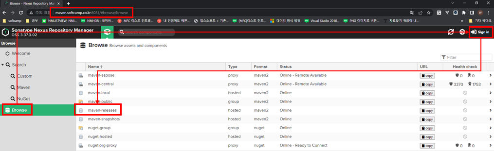
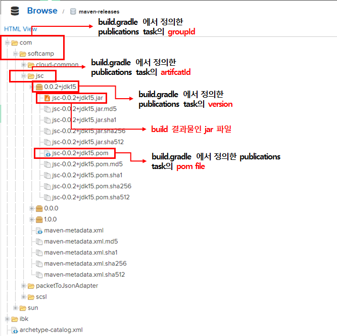
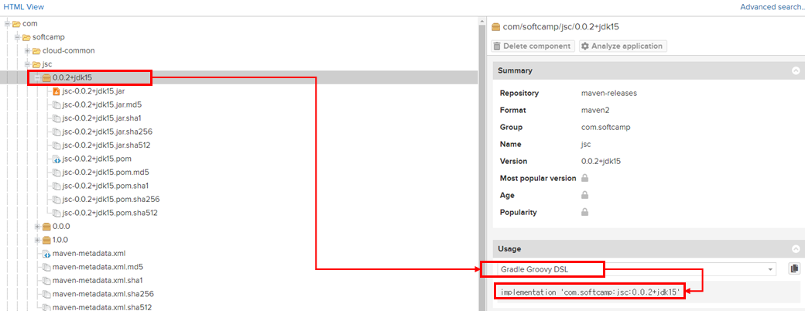

# 사내 maven repository를 활용한 공용 라이브러리 게시 및 사용법 (for gradle)

**신성범 수석님** 이 만들어 놓으신 사내 **maven repository** 를 활용하여 공용 라이브러리를 게시 및 사용하는 방법을 **gradle** 프로젝트 기준으로 작성하였습니다.

---

## 내 gradle 프로젝트 Publish 하는 방법

### 프로젝트의 build.gradle 수정

#### maven-publish 플러그인 추가

maven repo에 퍼블리싱을 도와주는 **maven-publish** 라는 플러그인을 사용합니다.

```groovy
plugins {
    // ...

    id 'maven-publish'

    // ...
}

```

#### shadowJar 플러그인 추가 (optional)

일반적인 java 프로젝트의 경우 빌드 시 사용하는 라이브러리를 미 포함한 상태로 빌드됩니다.
**shadowJar** 플러그인은 **사용하는 라이브러리를 포함한 상태로 빌드** 될 수 있도록 해줍니다.
일명 **뚱뚱한 jar**를 생성할 수 있습니다.

선택에 따라 사용 안하셔도 됩니다.

```groovy
plugins {
    // ...

    id 'com.github.johnrengelman.shadow' version '7.1.2'

    // ...
}
```

#### shadowJar Task 정의 (optional)

기본적으로 shadowJar 를 이용한 **뚱뚱한 jar** 를 생성하면 파일 이름에 `-all` 이라는 키워드가 자동으로 붙습니다. `(예시 : test-1.0.0-all.jar)`

이를 제거하기 위하여 아래와 같이 **shadowJar Task** 에 `archiveClassifier.set('')` 를 사용하여 키워드를 제거할 수 있습니다. `(적용 후 예시 : test-1.0.0.jar)`

선택에 따라 사용 안하셔도 됩니다.

```groovy
shadowJar {
    archiveClassifier.set('')
    dependencies {
        include(dependency('com.google.code.gson:gson:2.9.0')) // 포함하고자 하는 라이브러리에 대한 예시입니다.
    }
}
```

#### publishing Task 정의

```groovy

publishing {

    // 구역 1 : maven repo 인증을 위한 변수 값 셋팅
	String inputUsername = project.findProperty("username") ?: ""
	String inputPassword = project.findProperty("password") ?: ""

	if (inputUsername.isEmpty()) {
		if (project.hasProperty('softcampMavenRepoUserId')) {
			inputUsername = "$softcampMavenRepoUserId"
		} else {
			throw new GradleException("exception message : softcampMavenRepoUserId is undefined.");
		}
	}

	if (inputPassword.isEmpty()) {
		if (project.hasProperty('softcampMavenRepoUserPassword')) {
			inputPassword = "$softcampMavenRepoUserPassword"
		} else {
			throw new GradleException("exception message : softcampMavenRepoUserPassword is undefined.");
		}
	}

    // 구역 2 : publishing 될 결과물에 대한 정보를 정의하는 task
    publications {
        shadow(MavenPublication) { publication -> 
            project.shadow.component(publication)

            groupId = 'com.softcamp'
            artifactId = 'jsc'
            version = "1.0.0"

            println("publish infos")
            println("groupId : " + groupId)
            println("artifactId : " + artifactId)
            println("version : " + version)

            pom {
                name = 'My Library'
                description = 'A description of my library'
            }
        }
    }

    // 구역 3 : maven repository 정보 및 인증을 위한 task
    repositories {
        maven{
            credentials {
                username = inputUsername
                password = inputPassword
            }

			url = "https://maven.softcamp.co.kr/repository/maven-releases/"
        }
    }
}

```

예시의 publishing task 는 크게 **3구역**으로 분리할 수 있습니다.

##### 구역 1 : maven repo 인증을 위한 변수 값 셋팅

maven repo 인증 정보를 셋팅하기 위한 부분이며,

`gradlew publish -Pusername=test -Ppassword=1234` 와 같이 `username` 과 `password` 를 파라미터로 받을 수 있게 해줍니다.

만약 파라미터 생략 또는 값이 `""` 과 같이 비어있을 경우 **`<USER-HOME-PATH>/.gradle/gradle.properties`** 라는 파일의 `softcampMavenRepoUserId` 과 `softcampMavenRepoUserPassword` 값을 읽어오며, 해당 값도 없을 경우 예외를 발생시킵니다.

</br>

##### 구역 2 : publishing 될 결과물에 대한 정보를 정의하는 task

게시될 결과물에 대한 정보들을 정의할 수 있습니다.

`groupId`, `artifactId`, `version`, `pom` 와 같은 필수 값을 정의할 수 있습니다.

자세한 내용은 [Maven Publish Plugin 가이드](https://docs.gradle.org/current/userguide/publishing_maven.html) 에서 확인할 수 있습니다.

</br>

##### 구역 3 : maven repository 정보 및 인증을 위한 task

기본적으로 softcamp maven repo에 게시하기 위해서는 인증 정보가 필요합니다.
`사내 AD 계정` 과 연동되어 있기 때문에 바로 사용하실 수 있으십니다.

로직상으로는 **구역 1** 에서 셋팅된 `inputUsername` 과 `inputPassword` 값을 사용합니다.

더 자세한 내용은 신성범 수석님이 작성하신 [사내 Maven Repository 사용방법 정리](https://wiki.softcamp.co.kr/pages/viewpage.action?pageId=48217246) 에서 확인할 수 있습니다.

</br>
</br>

### 실제 publish 실행

위와 같이 `build.gradle` 을 수정하고 나면 이제 publish 가 가능해집니다.

```bash
gradlew publish
```

또는

```bash
gradlew publish -Pusername=<사내 AD 계정 ID> -Ppassword=<사내 AD 계정 PASSWORD>
```

과 같이 gradle 의 publish task 를 실행하여 publish 할 수 있습니다.

#### publish 결과 확인하기

  


1. 웹 브라우저에서 https://maven.softcamp.co.kr:8081/ 접속
2. LNB 에서 **"Browse"** 선택
3. **"Sign in"** 을 통해 **사내 AD 계정으로 로그인**
4. **maven-releases** 선택

  


5. **build.gradle 에서 정의한 publications task의 groupId 펼침**
6. **build.gradle 에서 정의한 publications task의 artifcatId 펼침**
7. **build.gradle 에서 정의한 publications task의 version 펼침**

</br>

---

## maven repository에 게시된 라이브러리 사용해보기

  

1. Usage 에서 **Gradle Groovy DSL** 선택
2. 내용 복사

```groovy
repositories { 
	mavenCentral()
	maven {
      	url "https://maven.softcamp.co.kr/repository/maven-public/"
		// allowInsecureProtocol = true
    }
}
```

3. 라이브러리를 사용 할 프로젝트의 **`build.gradle`** 에서 **softcamp maven repo url 추가**, mavenCentral() 을 지우지 않습니다. mavenCentral() 에서 해당 찾는 라이브러리가 없을 경우 추가된 **softcamp maven repo** 에서 마저 찾습니다. (allowInsecureProtocol : 해당 url이 http 일 경우 true 로 사용)
4. 


---
