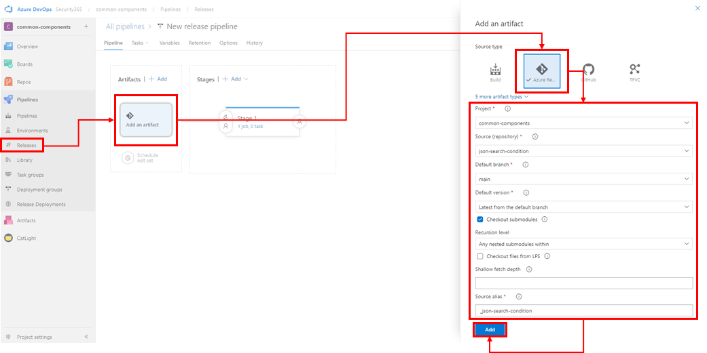
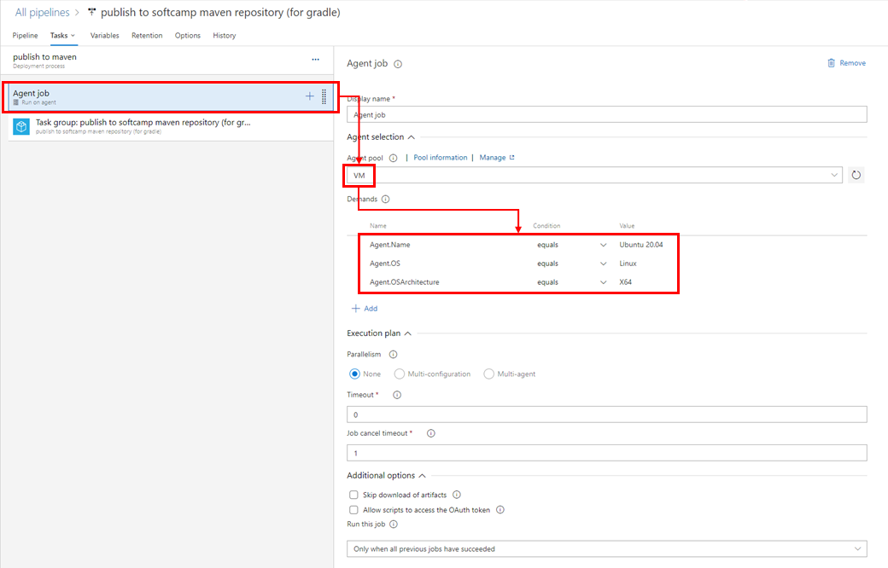
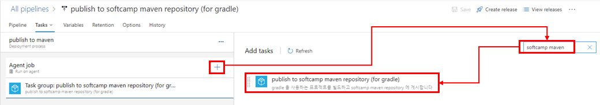
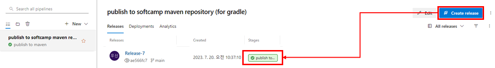
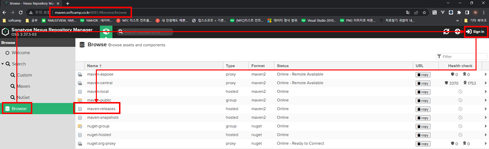
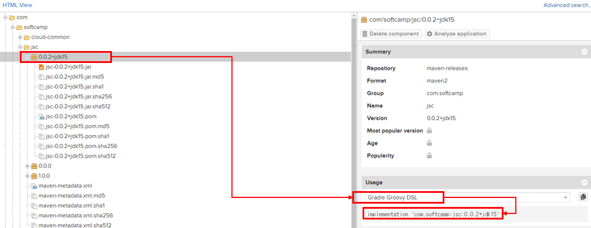

<!-- TOC -->

- [사내 maven repository를 활용한 공용 라이브러리 게시 및 사용법 (for gradle)](#사내-maven-repository를-활용한-공용-라이브러리-게시-및-사용법-for-gradle)
  - [프로젝트의 build.gradle 수정](#프로젝트의-buildgradle-수정)
    - [maven-publish 플러그인 추가](#maven-publish-플러그인-추가)
    - [shadowJar 플러그인 추가 (optional)](#shadowjar-플러그인-추가-optional)
    - [shadowJar Task 정의 (optional)](#shadowjar-task-정의-optional)
    - [publishing Task 정의](#publishing-task-정의)
      - [구역 1 : maven repo 인증을 위한 변수 값 셋팅](#구역-1--maven-repo-인증을-위한-변수-값-셋팅)
      - [구역 2 : publishing 될 결과물에 대한 정보를 정의하는 task](#구역-2--publishing-될-결과물에-대한-정보를-정의하는-task)
      - [구역 3 : maven repository 정보 및 인증을 위한 task](#구역-3--maven-repository-정보-및-인증을-위한-task)
  - [azure release pipeline 을 통한 maven repository에 publish 하기](#azure-release-pipeline-을-통한-maven-repository에-publish-하기)
    - [순서도](#순서도)
    - [Azure Self Hosted Agent 에 gradle.properties 파일 생성](#azure-self-hosted-agent-에-gradleproperties-파일-생성)
    - [Azure devops release pipeline 추가](#azure-devops-release-pipeline-추가)
      - [Agent Job 선택](#agent-job-선택)
      - [Task 추가](#task-추가)
    - [트리깅 방식 선택 (Optional)](#트리깅-방식-선택-optional)
    - [publish 테스트](#publish-테스트)
  - [publish 결과 확인하기](#publish-결과-확인하기)
  - [maven repository에 게시된 라이브러리 사용해보기](#maven-repository에-게시된-라이브러리-사용해보기)

<!-- /TOC -->

# 사내 maven repository를 활용한 공용 라이브러리 게시 및 사용법 (for gradle)

**신성범 수석님** 이 만들어 놓으신 사내 **maven repository** 를 활용하여 공용 라이브러리를 게시 및 사용하는 방법을 **gradle** 프로젝트 기준으로 작성하였습니다.

---


## 프로젝트의 build.gradle 수정

### maven-publish 플러그인 추가

maven repo에 퍼블리싱을 도와주는 **maven-publish** 라는 플러그인을 사용합니다.

```groovy
plugins {
    // ...

    id 'maven-publish'

    // ...
}

```

### shadowJar 플러그인 추가 (optional)

일반적인 java 프로젝트의 경우 빌드 시 사용하는 라이브러리를 미 포함한 상태로 빌드됩니다.
**shadowJar** 플러그인은 **사용하는 라이브러리를 포함한 상태로 빌드** 될 수 있도록 해줍니다.
일명 **뚱뚱한 jar**를 생성할 수 있습니다.

선택에 따라 사용 안하셔도 됩니다.

```groovy
plugins {
    // ...

    id 'com.github.johnrengelman.shadow' version '7.1.2'

    // ...
}
```

### shadowJar Task 정의 (optional)

기본적으로 shadowJar 를 이용한 **뚱뚱한 jar** 를 생성하면 파일 이름에 `-all` 이라는 키워드가 자동으로 붙습니다. `(예시 : test-1.0.0-all.jar)`

이를 제거하기 위하여 아래와 같이 **shadowJar Task** 에 `archiveClassifier.set('')` 를 사용하여 키워드를 제거할 수 있습니다. `(적용 후 예시 : test-1.0.0.jar)`

선택에 따라 사용 안하셔도 됩니다.

```groovy
shadowJar {
    archiveClassifier.set('')
    dependencies {
        include(dependency('com.google.code.gson:gson:2.9.0')) // 포함하고자 하는 라이브러리에 대한 예시입니다.
    }
}
```

### publishing Task 정의

```groovy

publishing {

    // 구역 1 : maven repo 인증을 위한 변수 값 셋팅
	String inputUsername = project.findProperty("username") ?: ""
	String inputPassword = project.findProperty("password") ?: ""

	if (inputUsername.isEmpty()) {
		if (project.hasProperty('softcampMavenRepoUserId')) {
			inputUsername = "$softcampMavenRepoUserId"
		} else {
			throw new GradleException("exception message : softcampMavenRepoUserId is undefined.");
		}
	}

	if (inputPassword.isEmpty()) {
		if (project.hasProperty('softcampMavenRepoUserPassword')) {
			inputPassword = "$softcampMavenRepoUserPassword"
		} else {
			throw new GradleException("exception message : softcampMavenRepoUserPassword is undefined.");
		}
	}

    // 구역 2 : publishing 될 결과물에 대한 정보를 정의하는 task
    publications {

        // 구역 2-1 : shadowJar 를 사용할 경우
        shadow(MavenPublication) { publication -> 
            project.shadow.component(publication)

            groupId = 'com.softcamp'
            artifactId = 'jsc'
            version = "1.0.0"

            println("publish infos")
            println("groupId : " + groupId)
            println("artifactId : " + artifactId)
            println("version : " + version)

            pom {
                name = 'My Library'
                description = 'A description of my library'
            }
        }

        // 구역 2-2 : shadowJar 를 사용하지 않을 경우
        // mavenJava(MavenPublication) {
        //     groupId = 'com.softcamp'
        //     artifactId = 'jsc'
        //     version = "1.0.0"

        //     println("publish infos")
        //     println("groupId : " + groupId)
        //     println("artifactId : " + artifactId)
        //     println("version : " + version)

        //     pom {
        //         name = 'My Library'
        //         description = 'A description of my library'
        //     }
        // }
    }

    // 구역 3 : maven repository 정보 및 인증을 위한 task
    repositories {
        maven{
            credentials {
                username = inputUsername
                password = inputPassword
            }

			url = "https://maven.softcamp.co.kr/repository/maven-releases/"
        }
    }
}

```

예시의 publishing task 는 크게 **3구역**으로 분리할 수 있습니다.

#### 구역 1 : maven repo 인증을 위한 변수 값 셋팅

maven repo 인증 정보를 셋팅하기 위한 부분이며,

`gradlew publish -Pusername=test -Ppassword=1234` 와 같이 `username` 과 `password` 를 파라미터로 받을 수 있게 해줍니다.

만약 파라미터 생략 또는 값이 `""` 과 같이 비어있을 경우 **`<USER-HOME-PATH>/.gradle/gradle.properties`** 라는 파일의 `softcampMavenRepoUserId` 과 `softcampMavenRepoUserPassword` 값을 읽어오며, 해당 값도 없을 경우 예외를 발생시킵니다.

</br>

#### 구역 2 : publishing 될 결과물에 대한 정보를 정의하는 task

게시될 결과물에 대한 정보들을 정의할 수 있습니다.

`groupId`, `artifactId`, `version`, `pom` 와 같은 필수 값을 정의할 수 있습니다.

자세한 내용은 [Maven Publish Plugin 가이드](https://docs.gradle.org/current/userguide/publishing_maven.html) 에서 확인할 수 있습니다.

</br>

#### 구역 3 : maven repository 정보 및 인증을 위한 task

기본적으로 softcamp maven repo에 게시하기 위해서는 인증 정보가 필요합니다.
`사내 AD 계정` 과 연동되어 있기 때문에 바로 사용하실 수 있으십니다.

로직상으로는 **구역 1** 에서 셋팅된 `inputUsername` 과 `inputPassword` 값을 사용합니다.

더 자세한 내용은 신성범 수석님이 작성하신 [사내 Maven Repository 사용방법 정리](https://wiki.softcamp.co.kr/pages/viewpage.action?pageId=48217246) 에서 확인할 수 있습니다.

---

## azure release pipeline 을 통한 maven repository에 publish 하기

release pipeline을 통하여 maven repository 에 publish 하는 방법을 알아보겠습니다.

**현재까지는 maven repository 의 url이 외부로 노출되어 있지 않기 때문에 (공인 도메인 아님) 필수로 사내에 구축되어진 Azure Self Hosted Agent 를 사용해야합니다**

**꼭! Azure Self Hosted Agent 사용!**

사내 maven repository url : https://maven.softcamp.co.kr/

### 순서도

  

### Azure Self Hosted Agent 에 gradle.properties 파일 생성

maven repo 인증 정보를 담아둘 gradle.properties 파일을 미리 Azure Self Hosted Agent 에 생성해놓아야 합니다.

- 경로 : `<HOME>/.gradle/gradle.properties`

`<HOME>/.gradle/` 경로에 `gradle.properties` 이 없을 경우 생성하고 있으면 내용을 추가해줍니다.

  

추가될 내용은 `softcampMavenRepoUserId` 과 `softcampMavenRepoUserPassword` 이며 사내 AD 계정을 사용하시면 됩니다.

```bash
softcampMavenRepoUserId=<사내 AD 계정 ID>
softcampMavenRepoUserPassword=<사내 AD 계정 PASSWORD>
```

  

### Azure devops release pipeline 추가

azure devops에서 해당 프로젝트에 release pipeline을 추가해야합니다.

이때 꼭 **Add an artifact** 단계에서 **Source type 을 Azure Repos Git** 으로 선택합니다.

publish 방식이 이미 빌드된 결과물(.jar) 를 가지고 publish 하는 것이 아닌 **gradlew** 를 통해 **build 빌드 직후 바로 publish 하는 방식**이라서 Azure Repos Git 선택이 **필수** 입니다

  

#### Agent Job 선택

다시 한번 말씀 드리지만 **현재까지는 maven repository 의 url이 외부로 노출되어 있지 않기 때문에 (공인 도메인 아님) 필수로 사내에 구축되어진 Azure Self Hosted Agent 를 사용해야합니다**

예시의 정보들은 제품개발 1팀에서 구축해놓은 Self Hosted Agent 를 사용하는 방법입니다.
차후 공식적으로 사내에서 운영하는 Self Hosted Agent 를 구축하고 이를 이용해야할 필요가 있습니다. (또는 팀 별 Self Hosted Agent 별도 구축)

Agent Pool : VM

Demands
|Name|Condition|Value|
|---|---|---|
|Agent.Name|equals|Ubuntu.20.04|
|Agent.OS|equals|Linux|
|Agent.OSArchitecure|equals|X64|

  

#### Task 추가

Task 추가 시 이미 만들어둔 **publish to softcamp maven repository (for gradle)** 이라는 **task group** 을 활용합니다

  

**publish to softcamp maven repository (for gradle)** 에서는 maven repo 인증을 위한 `username` 과 `password` 를 주입할 수 있는데 만약 `""` 로 빈 값을 명시할 경우

사전에 준비해놨던 `gradle.properties` 파일의 내용을 참조하게됩니다.

  

### 트리깅 방식 선택 (Optional)

트리깅 방식의 선택은 사실 프로젝트마다 다를 수 있습니다.
원하시는 방식으로 트리깅 하시면 됩니다.

여기서는 "branch push" 를 트리깅하도록 하였습니다.

저의 경우 "main branch" 는 정책상 일반 사용자가 바로 "push" 불가능하며, PR이 완료된 후 자동 Versioning 이 진행되면서 git tag를 생성 후 "main branch" 에 push되기 때문에 이 타이밍을 트리깅 합니다

  

### publish 테스트 

**수동**으로 **CreateRelease** 을 진행합니다.
**Stages** 가 **성공(초록색)** 으로 표시되면 정상적으로 release pipeline이 등록된 것 입니다.



---


## publish 결과 확인하기

  


1. 웹 브라우저에서 https://maven.softcamp.co.kr:8081/ 접속
2. LNB 에서 **"Browse"** 선택
3. **"Sign in"** 을 통해 **사내 AD 계정으로 로그인**
4. **maven-releases** 선택

  


5. **build.gradle 에서 정의한 publications task의 groupId 펼침**
6. **build.gradle 에서 정의한 publications task의 artifcatId 펼침**
7. **build.gradle 에서 정의한 publications task의 version 펼침**

</br>

---

## maven repository에 게시된 라이브러리 사용해보기

  

1. Usage 에서 **Gradle Groovy DSL** 선택
2. 내용 복사

```groovy
repositories { 
	mavenCentral()
	maven {
      	url "https://maven.softcamp.co.kr/repository/maven-public/"
		// allowInsecureProtocol = true
    }
}
```

3. 라이브러리를 사용 할 프로젝트의 **`build.gradle`** 에서 **softcamp maven repo url 추가**, mavenCentral() 을 지우지 않습니다. mavenCentral() 에서 찾는 라이브러리가 없을 경우 추가된 **softcamp maven repo** 에서 마저 찾습니다. (allowInsecureProtocol : 해당 url이 http 일 경우 true 로 사용)

```groovy
dependencies {
    // ...
	implementation 'com.softcamp:jsc:0.0.2+jdk15'
    // ...
}
```
4. 복사했던 내용을 **dependencies task** 에 추가해줍니다.
5. `./gradlew build --refresh-dependencies` 명령등으로 의존성들을 다시 다운 받습니다.

  

6. 라이브러리의 클래스를 사용할려고 할 때 정상적으로 패키지가 인식되면 라이브러리가 성공적으로 publish 된 것 입니다.
