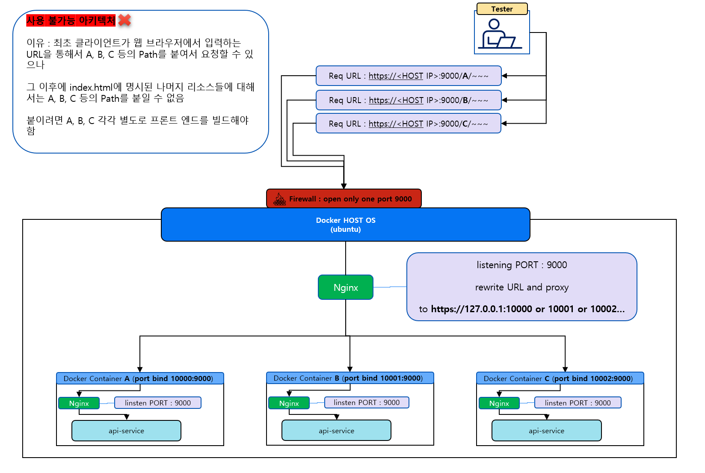
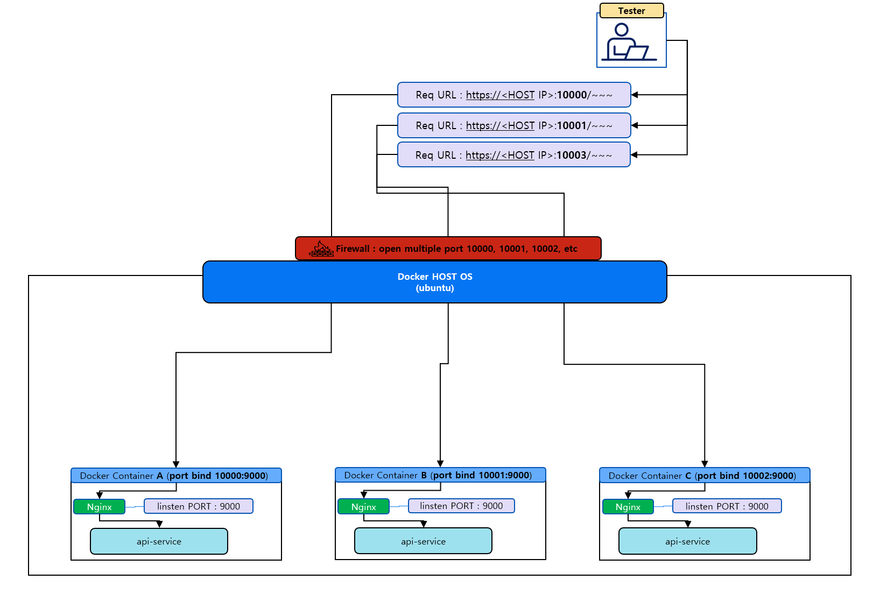

- [GateXcanner IMS 고객사별 테스트 환경 운영을 위한 정보](#gatexcanner-ims-고객사별-테스트-환경-운영을-위한-정보)
  - [문서 수정 히스토리](#문서-수정-히스토리)
  - [아키텍처](#아키텍처)
    - [URL Path 를 통한 조직(고객사) 분리 - 사용 불가능](#url-path-를-통한-조직고객사-분리---사용-불가능)
    - [조직(고객사) 별 포트로 분리 - 채택된 아키텍처](#조직고객사-별-포트로-분리---채택된-아키텍처)
  - [조직별 포트 맵핑 (2023-03-23ver)](#조직별-포트-맵핑-2023-03-23ver)
  - [테스트 환경 호스트 VM 정보](#테스트-환경-호스트-vm-정보)
  - [WEB \& API 요청 예시](#web--api-요청-예시)
    - [Sample WEB](#sample-web)
    - [Sample API](#sample-api)
    - [SK하이닉스 WEB](#sk하이닉스-web)
    - [SK하이닉스 API](#sk하이닉스-api)
    - [한국전력거래소 WEB](#한국전력거래소-web)
    - [한국전력거래소 API](#한국전력거래소-api)
  - [새로운 조직 추가 시 주의 사항 (중요!!)](#새로운-조직-추가-시-주의-사항-중요)
    - [HOST의 리소스 여유 상태 확인](#host의-리소스-여유-상태-확인)
      - [현재 도커 컨테이너들의 리소스 사용현황 확인 방법](#현재-도커-컨테이너들의-리소스-사용현황-확인-방법)
    - [컨테이너 삭제로인한 데이터 증발 주의](#컨테이너-삭제로인한-데이터-증발-주의)

# GateXcanner IMS 고객사별 테스트 환경 운영을 위한 정보

## 문서 수정 히스토리

- **2023-03-23 :** 조직별 포트 맵핑 baseline 추가

## 아키텍처

### URL Path 를 통한 조직(고객사) 분리 - 사용 불가능

최초에 해당 아키텍처를 사용하려 하였으나, index.html 에 정의된 리소스들을 요청할때 고객사별 path를 지정해주기 위해서는 고객사별로 별도로 build 해야하는 문제가 발생하기 때문에 사용 불가능하다고 판단하였습니다.

  

### 조직(고객사) 별 포트로 분리 - 채택된 아키텍처

조직을 포트로 구분하기로 선택하였고, **단점으로는** 해당 포트가 어떤 고객사인지 기억 또는 별도의 포트와 조직별 맵핑된 문서를 봐야합니다.

  

---

## 조직별 포트 맵핑 (2023-03-23ver)

|조직(고객사)|포트|
|---|---|---|
|sample|10000|
|SK하이닉스|10001|
|한국전력거래소|10002|
|baseline|10003|

---

## 테스트 환경 호스트 VM 정보

- **OS** : Ubuntu 22.04
- **보조 기억 장치 용량** : 512GB
- **RAM** : 64GB
- **IP** : 10.31.10.101 (고정 IP)
- **ID/PW** : softcamp / <제품개발팀에서 흔히 사용하는 숫자,특수문자 조합의 그 패스워드>

---

## WEB & API 요청 예시

### Sample WEB

```url
https://10.31.10.101:10000
```

### Sample API

```url
https://10.31.10.101:10000/api/~~~
```

### SK하이닉스 WEB

```url
https://10.31.10.101:10001
```

### SK하이닉스 API

```url
https://10.31.10.101:10001/api/~~~
```

### 한국전력거래소 WEB

```url
https://10.31.10.101:10002
```

### 한국전력거래소 API

```url
https://10.31.10.101:10002/api/~~~
```

---

## 새로운 조직 추가 시 주의 사항 (중요!!)

### HOST의 리소스 여유 상태 확인

현재 컨테이너들이 호스트의 리소스를 얼마나 사용중인지 체크 후 여유 공간이 있을 때 새로운 조직(고객사)의 컨테이너를 추가해야합니다.

만약 부족하다면 먼저 리소스를 확보 후 진행해주시길 바랍니다.

> **주의 : 리소스가 부족한 상태에서 새로운 컨테이너를 실행했을 때 기존에 동작중인 컨테이너가 다운 또는 내부 실행중인 서비스들이 강제 종료 될 가능성이 높습니다**

#### 현재 도커 컨테이너들의 리소스 사용현황 확인 방법

```bash
sudo docker stats
```

### 컨테이너 삭제로인한 데이터 증발 주의

테스트 환경 컨셉 자체를 azure pipeline을 통해 생성된 image 에 대한 풀 테스트를 목적으로,

새로운 버전의 이미지가 생성되면 아예 처음부터 데이터들을 새로 쌓아가며 테스트하고자

컨테이너에서 생성하는 데이터들을 **영속화** 하지 않습니다. (별도의 호스트 영역을 마운팅해서 쓰는 방식을 사용하지 않음)

그렇기 때문에 컨테이를 삭제하는 경우 (ex : sudo docker rm <컨테이너>) 컨테이너에서 생성한 데이터들을 모두 삭제됩니다.

항상 이 점을 주의 부탁드리겠습니다.
