- [GateXcanner IMS 고객사별 테스트환경 Docker Image 생성 및 배포 Pipeline 설명](#gatexcanner-ims-고객사별-테스트환경-docker-image-생성-및-배포-pipeline-설명)
  - [문서 수정 히스토리](#문서-수정-히스토리)
  - [개요 : 도커 이미지로 배포하는게 아닌 서비스에 갑자기 웬 도커??](#개요--도커-이미지로-배포하는게-아닌-서비스에-갑자기-웬-도커)
    - [고객사마다 다른 환경](#고객사마다-다른-환경)
    - [고객사별 개발 환경을 VM으로 관리하면 발생하는 문제점](#고객사별-개발-환경을-vm으로-관리하면-발생하는-문제점)
      - [많은 용량 차지](#많은-용량-차지)
      - [생성하는데 많은 시간 소모](#생성하는데-많은-시간-소모)
      - [변경된 형상에 대한 히스토리 관리의 어려움](#변경된-형상에-대한-히스토리-관리의-어려움)
      - [내,외부로 형상 공유의 어려움](#내외부로-형상-공유의-어려움)
      - [자동화의 어려움](#자동화의-어려움)
      - [무수히 많이 추가되는 고객사](#무수히-많이-추가되는-고객사)
    - [도커를 채택하면서 해결되는 문제점](#도커를-채택하면서-해결되는-문제점)
  - [GateXcanner 고객사별 테스트 환경 자동화 아키텍처](#gatexcanner-고객사별-테스트-환경-자동화-아키텍처)
    - [용어 설명](#용어-설명)
    - [일반 사용자별 역할](#일반-사용자별-역할)
  - [Pipeline 관리](#pipeline-관리)
    - [신규 고객사 추가](#신규-고객사-추가)
      - [ims-docker-image-release 수정](#ims-docker-image-release-수정)
      - [신규 고객사의 "Stage" 추가](#신규-고객사의-stage-추가)
      - [Agent 선택](#agent-선택)
        - [Agent pool](#agent-pool)
        - [Demands](#demands)
      - [Stage 에 "Create IMS Service Starter Task" 추가](#stage-에-create-ims-service-starter-task-추가)
        - [매개 변수 설명](#매개-변수-설명)
      - [Stage 에 "Build and push ims docker image Task" 추가](#stage-에-build-and-push-ims-docker-image-task-추가)
        - [매개 변수 설명](#매개-변수-설명-1)
        - [Docker Base Image의 선택](#docker-base-image의-선택)
  - [만들어진 Pipeline 동작시키기](#만들어진-pipeline-동작시키기)
    - [수동으로 Pipeline 실행](#수동으로-pipeline-실행)
    - [동작 상황 모니터링](#동작-상황-모니터링)
    - [ACR에 업로드된 Docker Image 확인](#acr에-업로드된-docker-image-확인)
  - [Tester 입장에서 Docker Image 가져다 사용하기](#tester-입장에서-docker-image-가져다-사용하기)
    - [테스트할 Docker Image PULL](#테스트할-docker-image-pull)
    - [컨테이너 실행](#컨테이너-실행)
    - [Service Starter 실행](#service-starter-실행)
    - [실제 Service 동작 여부 확인](#실제-service-동작-여부-확인)
  - [마무리](#마무리)

# GateXcanner IMS 고객사별 테스트환경 Docker Image 생성 및 배포 Pipeline 설명

## 문서 수정 히스토리

- **2023-03-20 :** 조직별 config repository 로 부터 데이터를 참조하는 내용 추가


안녕하세요? 제품개발 1팀에서 주로 웹 백엔드 개발 업무를 하고있는 신우섭입니다.

온프레미스 제품에 대하여 고객사별 테스트 환경을 구축해본 경험과 GateXcanner 제품 관련 업무를 맡는 분들에게 가이드를 드리고자 글을 작성하였습니다.

---

## 개요 : 도커 이미지로 배포하는게 아닌 서비스에 갑자기 웬 도커??

GateXcanner 제품은 온프레미스 제품으로, 실제 고객사에 배포될 때 단순히 실행 파일 및 Config 파일로 배포됩니다. 한데 갑자기 왜 도커가 튀어나왔을까요.

### 고객사마다 다른 환경

온프레미스의 제품들은 고객사마다 설치된 환경이 다를 수 있습니다.

예를들어 아래와 같이 3개의 고객사가 존재한다 할 때 각 고객사 환경을 예로 들어보겠습니다.

| 환경                  | A 고객사 | B 고객사 | C 고객사   |
| --------------------- | -------- | -------- | ---------- |
| OS                    | Centos 7 | RedHat 8 | Centos 7   |
| JDK                   | 11       | 14       | 17         |
| DB                    | MS-SQL   | MariaDB  | Postgresql |
| Elasticsearch Version | 7.8.1    | 7.17.6   | 8.0.1      |
| Nginx Version         | 1.18.0   | 1.20.0   | 1.20.2     |
| API Version           | 1.0.0    | 1.0.4    | 1.3.3      |
| CLIENT Version        | 2.0.1    | 2.0.0    | 2.1.5      |

위와 같이 각각의 고객사가 서로 다른 환경을 지니게될 경우가 존재합니다.
물론 최대한 동일한 형상을 유지해야겠지만 고객사의 요구로 인하여 어쩔 수 없이 하나, 두개 변경하다보면 기준 환경에서 많이 달라지게 됩니다.

문제는 이렇게 고객사 환경이 시시각각 달라지면 내부 테스트는 이를 따라갈 수 없다는 점 입니다.

**"고객사 수 만큼 개발 환경 VM을 만들고 관리하면 되지 않나?"**

라는 의문이 들 수 있습니다.

불가능한건 아닙니다. 하지만 VM으로 고객사 형상과 맞는 개발 환경구성에는 아래와 같은 문제점들이 존재합니다.

### 고객사별 개발 환경을 VM으로 관리하면 발생하는 문제점

#### 많은 용량 차지

VM을 사용해보신 분들은 알겠지만 이미지 파일 하나당 상당히 큰 용량이 필요합니다.
이런 VM 이미지를 고객사마다 생성하게되면 많은 저장공간을 차지하게됩니다.

#### 생성하는데 많은 시간 소모

VM 생성은 OS를 직접 설치하게됩니다. 컴퓨터 OS를 직접 설치하고 고객사와 동일한 환경으로 설정값들을 맞춰주는 과정은 많은 시간을 소모하게 됩니다.

#### 변경된 형상에 대한 히스토리 관리의 어려움

특정 고객사가 빈번하게 형상 변경이 된다고 할 경우
이 고객사가 어떠한 변화 흐름을 가져왔는지, 변화에 흐름동안 서비스들이 정상적으로 동작하였는지 등 시간이 지남에 따라 확인이 어려워집니다.

물론 스냅샷이라는 기능이 있지만 스냅샷은 가상 머신의 운영 체제, 라이브러리, 애플리케이션, 데이터 등 모든 것을 포함하는 데이터이기 때문에 용량이 상당합니다 **많은 용량 차지** 라는 문제점이 발생하게됩니다.

#### 내,외부로 형상 공유의 어려움

이미지 파일은 보통 수십 기가바이트로 이를 네트워크로 전달하고자 할 경우 상당항 시간이 소요되며, 물리적으로 공유할때도 그 크기에 맞는 저장장치를 구해야하기 때문에 어려움이 발생합니다.

#### 자동화의 어려움

저희가 내부에서 사용하는 Azure DevOps 를 포함하여 CI/CD 를 도와주는 여러 서비스들에서 VM을 통한 배포 방식은 기본으로 지원하지 않습니다. 그렇기 때문에 VM을 통한 CI/CD 기능을 하나하나 전부 만들어야하는 어려움이 발생합니다.

#### 무수히 많이 추가되는 고객사

제품이 팔릴때 마다 고정된 고객사가 아닌 새로운 고객사가 추가되는 경우가 빈번합니다.
이 때마다 VM을 만들어내기에는 시간적 리소스가 많이 소모됩니다.

위와 같은 문제로 인하여 VM으로 관리하기에는 현실적인 문제들이 발생하기 때문에, 다른 방법으로 **도커** 가 선택됩니다.

### 도커를 채택하면서 해결되는 문제점

도커를 사용하게되면서 위 문제들은 해결됩니다.

- **많은 용량 차지 ->**  도커는 **호스트 시스템의 리눅스 커널을 공유**하기 때문에 컨테이너 간에 파일 시스템을 공유하여 VM이미지에 비해 상대적으로 굉장히 적은 용량을 쓰게 됩니다. 또한 도커의 특성으로 도커 허브등에 이미지를 저장할 경우 이전 이미지와 중복되는 이미지 레이어들은 한번만 저장되기 때문에 상대적으로 적은 용량이 필요합니다.
- **생성하는데 많은 시간 소모 ->** 도커는 이미지 컨테이너를 생성하는 프로세스임으로 VM과 같이 전체 운영 체제를 가상화하지 않아 생성 속도가 빠릅니다
- **변경된 형상에 대한 히스토리 관리의 어려움 ->** VM을 이용한 스냅샷은 큰 용량을 차지하지만 자체 도커 허브등을 구축하여 사용할 경우 도커의 이미지 레이어 특성으로 인하여 VM 스냅샷보다 적은 용량으로 히스토리를 관리할 수 있습니다.
- **내,외부로 형상 공유의 어려움 ->** 도커 허브를 통하여 인터넷이 가능한 어느곳에서든 이미지를 다운받을 수 있게됩니다.
- **자동화의 어려움 ->** 시중에 사용되는 여러 자동화 서비스들이 도커에 대한 기능들은 대부분 갖추고 있기 때문에 별도의 기능들을 만들어낼 필요성이 적어집니다.
- **무수히 많이 추가되는 고객사 ->** Base 이미지만 존재할 경우 DockerFile통해 손쉽게 추가되는 고객사 환경을 만들어낼 수 있습니다.

---

## GateXcanner 고객사별 테스트 환경 자동화 아키텍처

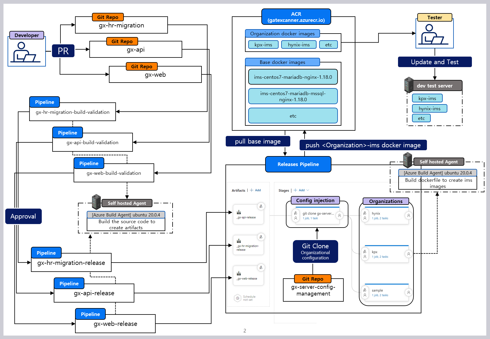  

### 용어 설명

- **`Developer`** : 소스코드를 수정하게되는 개발자입니다. GitRepo 에 본인이 수정한 소스코드를 **PR(PullRequest)** 합니다.
- **`GitRepo`** : 소스코드 관리를 위한 AzureDevOps 프로젝트별 소스코드 저장소입니다. 버전 및 변경 이력등을 저장할 수 있습니다.
- **`Pipelines & Release Pipeline`** : Azure DevOps의 Pipeline은 소프트웨어 개발 및 배포 프로세스를 자동화하는 CI/CD(Continuous Integration/Continuous Deployment) 툴입니다. Pipeline을 사용하면 소스 코드 변경 사항을 자동으로 빌드하고, 테스트하고, 배포할 수 있습니다. 여기서 **빌드**와 **배포** 개념을 분리한 두 가지 유형의 Pipeline이 존재하는데 **빌드 : pipeline** 과 **배포 : ReleasePipeline** 이 있습니다.
- **`Pipelines`** : **빌드** 전용 파이프라인 입니다. 소스코드를 가져와 컴파일, 빌드 및 테스트를 수행합니다. 개발자들이 새로운 코드를 작성할 때마다 자동으로 빌드를 수행하여 릴리스를 준비하며, 일반적으로 CI(Continuous Integration) Pipeline입니다.
- **`Release Pipeline`** : **배포** 전용 파이프라인 입니다. **Pipeline 에서 생성된 빌드 아티팩트**들을 가져와서 릴리스 및 배포할 수 있습니다. 이 Pipeline은 일반적으로 DevOps 엔지니어, 운영팀 또는 릴리스 매니저 등이 사용하는 CD(Continuous Deployment) Pipeline입니다.
- **`ACR(Azure Container Registry)`** : Microsoft Azure에서 제공하는 완전 관리형 컨테이너 이미지 레지스트리 서비스입니다. 간단하게 도커 이미지 관리용이라고 보시면 되겠습니다.
- **`Self hosted Agent`** : Self-hosted agent는 조직의 **서버, 가상 머신 또는 컨테이너**에서 실행되는 Azure Pipelines agent입니다. Self-hosted agent는 조직의 네트워크에서 빌드 및 배포 작업을 수행하므로 클라우드 기반 빌드 및 배포 서비스를 사용할 수 없는 경우에도 사용할 수 있습니다.
- **`Tester`** : ACR에 존재하는 고객사별 이미지를 이용하여 테스트 작업을 진행하는 인원입니다.
- **`Dev test server`** : 개발 단계에서 테스트를 진행하기 위한 테스트 서버입니다. 고객사별 도커 컨테이너를 항상 실행상태로 유지하여 언제든 테스트가 가능하도록 합니다.
- **`Config injection`** : 조직(고객사)별 server의 config들이 각각 다를 수 있기 때문에 config를 별도로 관리하는 git repo로 부터 config를 얻어와 주입합니다.

### 일반 사용자별 역할

- **`개발자`** : 소스코드를 수정하는 개발자입니다. 소스코드가 수정이 완료되면 **Git Repo의 Main branch** 로 **PR**을 요청합니다. PR 시점에서 자동으로 **Build Validation pipeline** 이 동작합니다.

- **`PR 관리자`** : 개발자가 요청한 **PR** 에 대하여 **Build Validation pipeline** 이 정상적으로 통과되었는지, 소스코드의 품질에 이상이 없는지를 판단한 후 **Approval** 합니다. **Approval** 되면 자동으로 **Artifact 생성을 위한 Build pipeline** 과 **Release Pipeline** 이 동작합니다.

- **`테스터`** : **Release Pipeline** 이 정상적으로 완료되면 **ACR**에 이미지가 업로드 될 텐대, **Dev test server** 에서 테스트가 필요한 고객사별 이미지를 다운하여 컨테이너를 실행하고. 해당 컨테이너 환경에서 테스트를 진행합니다. 테스트가 정상적으로 완료된 후 문제가 없다면 배포를 승인하거나 또는 **pre-release(위 글에서는 다루지 않습니다)** 환경에서 다시 한번 테스트를 진행합니다.

---

## Pipeline 관리

예를들어 신규 고객사 및 신규 Git Repo 또는 Base DockerImage의 변경 등이 이뤄졌을 경우 기존 Pipeline의 수정이 이뤄져야합니다. 해당 작업은 **DevOps Engineer** 가 담당하게되는 역할이며 아래는 GateXcanner 의 Pipeline을 수정하게되는 경우에 대한 몇가지 예시와 방법입니다.

### 신규 고객사 추가

Pipeline의 수정이 빈번하게 이뤄질 경우가 신규 고객사의 추가입니다.

"sample" 이라는 고객사가 추가된다고 가정하에 예시를 들어보겠습니다.

#### ims-docker-image-release 수정

도커 이미지를 만들어내는 **"Release pipeline"** 의 이름은 **ims-docker-image-release** 입니다.
이 **ims-docker-image-release** 를 수정해야합니다.

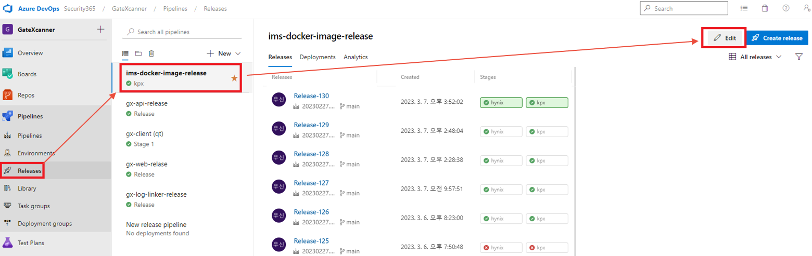  

#### 신규 고객사의 "Stage" 추가

고객사의 추가는 **"Release pipeline"** 의 **Stage**추가로 이어집니다.
**고객사와 Stage는 1:1 맵핑**입니다 이 점을 주의해주세요

저희가 등록하려는 고객사의 명이 "sample" 이기 때문에 stage의 이름은 "sample" 로 맞춰줍니다.

> **잠깐! Stages 란?**
> pipeline에서 **stages**는 파이프라인을 여러 단계로 구성하는 경우에 사용됩니다. 논리적인 단계로 일련의 관련된 작업 집합을 의미합니다. 이 말이 좀 어려울 수 있는데 예를 들어 **Build, Test, Deploy** 들이 각각 관련된 하나의 작업 집합으로 표현될 수 있습니다.
> 저는 이 stage를 "조직(고객사)"라는 좀 큰 범위로 묶었습니다.

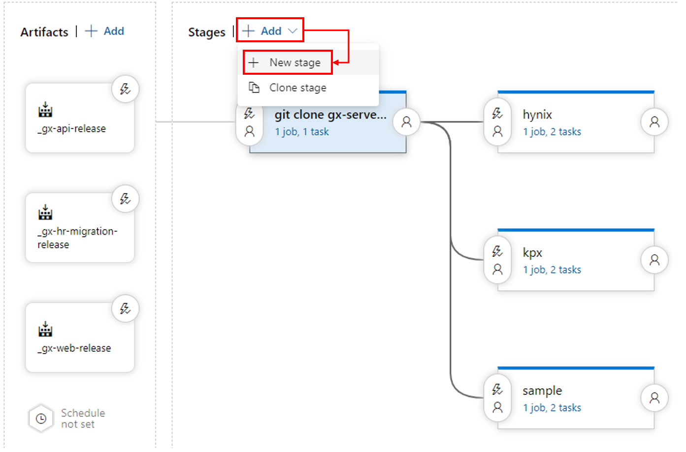  
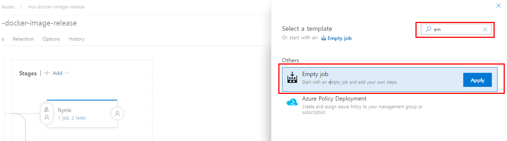  
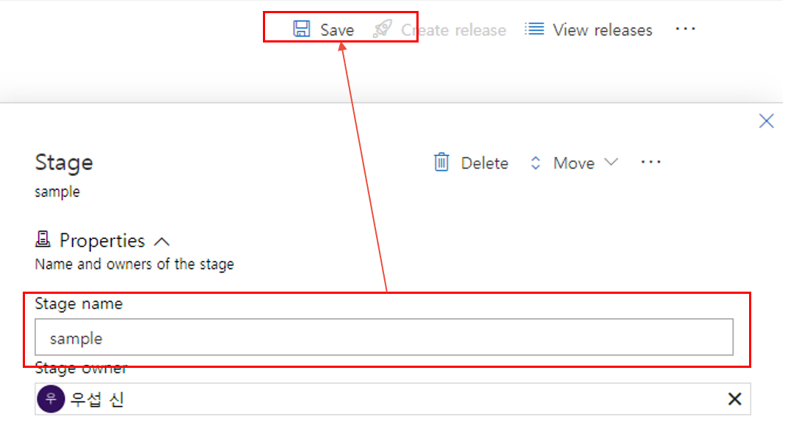

#### Agent 선택

자 저희가 추가한 Stage가 동작할 환경을 선택해야합니다.

결국 빌드 및 배포를 위해서는 어딘가의 PC에서 이 작업이 이뤄져야하는데, 이를 위한 PC를 선택하는 것이 Agent 선택이라고 생각하시면 됩니다.

이 선택된 Agent에서 저희가 추가한 Task 작업들이 이뤄집니다.

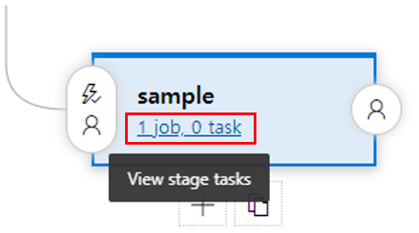  
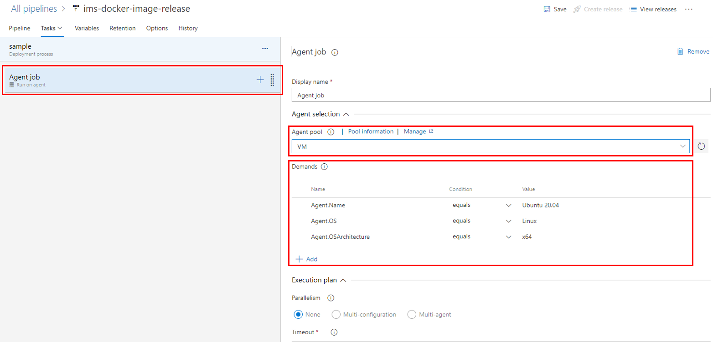  

##### Agent pool

- **VM** : 제품개발 1팀에서 구축해놓은 Self hosted Agent Pool 입니다. MS에서 재공하는 Agent들이 아니기에 Task에 필요한 기타 환경들을 다운해야하는 단점이 있지만, Private하고 사내 시스템과 연결하기 쉽다는 장점이 있습니다. 다수의 Self hosted Agent 가 존재할 수 있으며 **Demands 를 통해 사용할 Agent를 선택해야합니다.**

Agent pool 에 어떠한 agent들이 존재하는지 확인하기 위해서는 관리자 권한이 필요하며, 아래와 같은 페이지에서 확인할 수 있습니다.

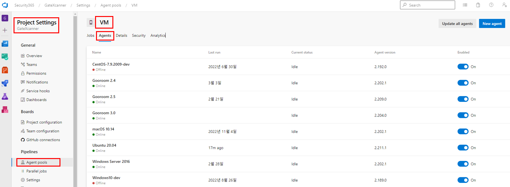  

##### Demands

Agent Pool에 등록된 여러 Agent중 실제로 사용될 Agent를 선택하기 위한 Filter 라고 보시면 됩니다.

위 조건을 통해 Agent가 선택됩니다.

GateXcanner 자동화를 위한 **Agent는 Ubuntu 20.04 Agent**가 있습니다.

위 이미지와 같이 Demands 를 지정해주면 **Ubuntu 20.04 Agent** 에서 Task가 동작하게 됩니다.

#### Stage 에 "Create IMS Service Starter Task" 추가

도커 컨테이너 방식으로 IMS Service를 운용할 경우 실제 온프레미스 환경처럼 system daemon을 사용할 수 없습니다. **(억지로 사용할 수 있지만 이럴 경우 Docker 컨테이너를 통해 호스트 OS에 접근할 수 있는 취약점이 발생하므로 권장하지 않습니다)**

그렇기 때문에 Service를 수동으로 실행시켜야하는데, 이를 사용자가 직접 하나씩 키기에는 번거롭기 때문에 **서비스를 한번에 실행해 줄 Script**가 필요합니다. **Create IMS Service Starter Task**는 이러한 Script를 생성해주는 Task입니다.

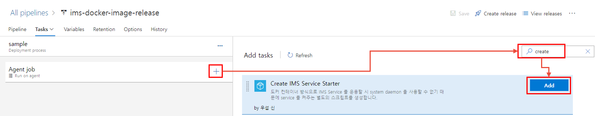
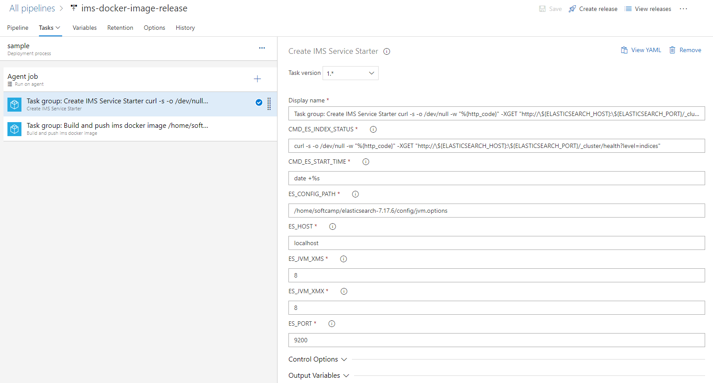  

##### 매개 변수 설명

- **`Display name`** : Task의 이름을 이름을 지정할 수 있습니다.
- **`CMD_ES_INDEX_STATUS`** : 엘라스틱 서치의 INDEX 상태를 확인하기 위한 명령어 입니다. 되도록이면 수정을 금지합니다.
- **`CMD_ES_START_TIME`** : 엘라스틱 서치의 상태값 확인을 주기적으로 하기 위해서 시스템 현재 시간을 얻는 명령어 입니다. 되도록 수정을 금지합니다.
- **`ES_HOST`** : 엘라스틱 서치가 서비스 될 때 사용할 주소입니다 (IP 또는 도메인)
- **`ES_PORT`** : 엘라스틱 서치가 서비스 될 때 사용할 포트 번호입니다.
- **`ES_JVM_XMS`** : 엘라스틱 서치 실행 시 jvm '-XmsNg' 옵션의 N값을 지정합니다.
- **`ES_JVM_XMX`** : 엘라스틱 서치 실행 시 jvm '-XmxNg' 옵션의 N값을 지정합니다.
- **`ES_CONFIG_PATH`** : 엘라스틱 서치의 Config 파일 경로를 명시합니다. (이 위치에 config를 옮긴다던가 하는건 아닙니다.)

만약 elasticsearch가 다른 PC에 존재할 경우 ES_HOST 및 ES_PORT 를 수정해야합니다.
"sample" 고객사의 경우 **localhost**에 elasticsearch가 설치되어있다고 가정하겠습니다.

#### Stage 에 "Build and push ims docker image Task" 추가

ims 개발 테스트용 도커 이미지를 생성 및 배포하는 Task입니다.

내부적으로는 **다수의 Task를 하나의 Task로 묶은 Task group** 이며,
아래와 같은 Task들이 존재합니다.

- **`Create IMS Dockerfile`** : ims docker file을 생성합니다.
- **`build`** : 생성된 dockerfile을 빌드합니다.
- **`push`** : 생성된 docker image를 ACR에 push 합니다.
- **`Delete image after push`** : agent의 용량을 확보하기 위하여 push 완료된 image를 삭제합니다.

실제로 Task group는 **pipelines -> task groups > build and push ims docker image** 에서 확인하실 수 있습니다.

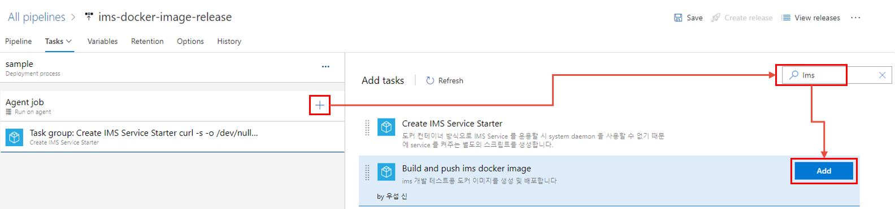
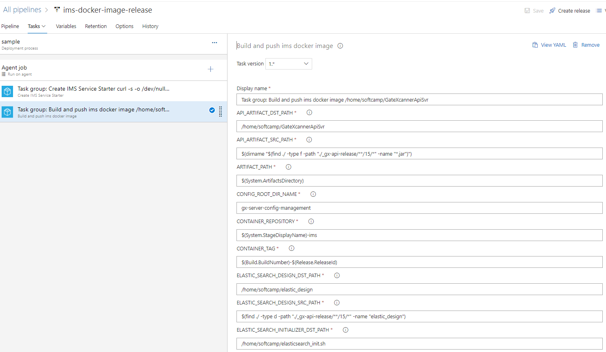  
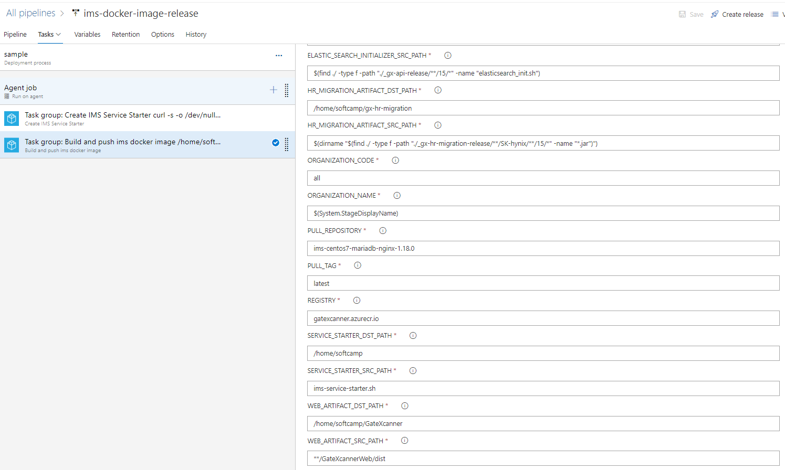  

해당 Task의 매개변수는 상당히 많은 편입니다.

대부분 Task group 안에 포함된 **Create IMS Dockerfile** 이라는 Task가 사용하는 변수들이며,

아래는 각 매개 변수의 설명입니다.

##### 매개 변수 설명

- **`Display name`** : Task의 이름을 이름을 지정할 수 있습니다.
- **`API_ARTIFACT_DST_PATH`** : API 서비스 아티팩트가 컨테이너 상에 위치할 경로입니다.
- **`API_ARTIFACT_SRC_PATH`** : 호스트 OS 상에 위치하는 API 서비스 아티팩트의 경로입니다. default 값으로 들어간 명령어는 gx api artifacts는 기본적으로 .jar형식으로 생성되나 경로 중간에 빌드 날짜 및 jdk 버전 등 옵셔널한 값이 들어가게되어 아티팩트의 경로가 항상 일정하지 않습니다. 그렇기 때문에 명령어를통하여 .jar 파일이 존재하는 디렉토리 경로를 찾도록 하였습니다.
- **`ARTIFACT_PATH`** : 릴리즈 파이프라인 실행시 다운로드되는 아티팩트들이 위치하는 경로입니다.
- **`CONTAINER_REPOSITORY`** : 도커 파일 빌드 시 생성될 이미지의 레포지토리 명입니다.
- **`CONTAINER_TAG`** : 도커 파일 빌드 시 생성될 이미지의 태그 명입니다.
- **`ELASTIC_SEARCH_DESIGN_DST_PATH`** : 엘라스틱 서치 설정을 위한 파일들이 모여있는 디렉토리가 컨테이너 상에서 위치할 경로입니다.
- **`ELASTIC_SEARCH_DESIGN_SRC_PATH`** : 엘라스틱 서치 설정을 위한 파일들이 모여있는 디렉토리가 호스트 OS사에 위치한 경로입니다.
- **`ELASTIC_SEARCH_INITIALIZER_DST_PATH`** : 엘라스틱 서치 초기화를 진행할 파일이 컨테이너 상에서 위치할 경로입니다.
- **`ELASTIC_SEARCH_INITIALIZER_SRC_PATH`** : 엘라스틱 서치 초기화를 진행할 파일이 호스트 OS상에 위차하고있는 경로입니다.
- **`HR_MIGRATION_ARTIFACT_DST_PATH`** : RDB와 GateXcannerApiSvr 과의 인사정보 연동을 위한 서비스가 도커 이미지상에서 위치할 경로입니다.
- **`HR_MIGRATION_ARTIFACT_SRC_PATH`** : RDB와 GateXcannerApiSvr 과의 인사정보 연동을 위한 서비스가 호스트OS에서 위치하고있는 경로입니다. 여기서 주의해야하는 점이 하나 있습니다. 기본값을 보면 아래와 같을 텐대 중간에 **SK-hynix** 과 같이 특정 조직의 이름이 들어가있습니다. 이 정보는 잘못된 정보기 보다는 **HR_MIGRATION** 서비스의 종류가 크게 **SK-hynix, kpx** 두 조직의 방식을 기준으로 나눠져 있어서 그렇습니다. 나중에는 고객사 이름이 빠지고 **방식의 이름**으로 변경될 가능성이 높습니다.
`$(dirname "$(find ./ -type f -path "./_gx-hr-migration-release/**/SK-hynix/**/15/*" -name "*.jar")")`
- **`ORGANIZATION_CODE`** : 조직 코드입니다. 이 값을 기준으로 front-end 의 **VUE_APP_COMPANY** 프로퍼티의 값이 지정됩니다.
- **`ORGANIZATION_NAME`** : 조직 이름입니다. 이 값을 기준으로 config repo에서 얻어온 조직별 디렉토리 명을 구분합니다.
- **`PULL_REPOSITORY`** : 생성될 도커 파일의 베이스 이미지 레포지토리 명입니다.
- **`PULL_TAG`** : 생성될 도커 파일의 베이스 이미지 태그 명입니다.
- **`REGISTRY`** : 도커 이미지를 다운로드, 업로드할 레지스트리 주소입니다.
- **`SERVICE_STARTER_DST_PATH`** : 컨테이너에서 IMS 서비스가 동작하도록 하기 위한 단일 서비스들을 실행시키는 스크립트의 컨테이너상의 경로입니다.
- **`CONFIG_ROOT_DIR_NAME`** : 서버 셋팅에 필요한 config 파일들이 위치한 최상위 폴더 이름 입니다.
- 

**CONTAINER_REPOSITORY** 는 기본적으로 빈값입니다.
생성될 Docker Image의 경우 분리를 쉽게 하기 위하여 고객사 명을 **REPOSITORY** 로 사용합니다.

저희가 생성할 고객사는 **"sample"** 이기 때문에 **CONTAINER_REPOSITORY** 의 값을 **"sample"** 로 지정해줍니다.

##### Docker Base Image의 선택

**Docker Base Image** 는 **REGISTRY, PULL_REPOSITORY, PULL_TAG** 세개의 매개변수 값으로 정해집니다.

예들어 각 변수의 값이 아래와 같을 때

- **REGISTRY** = gatexcanner.azurecr.io
- **PULL_REPOSITORY** = ims-centos7-mariadb-nginx-1.18.0
- **PULL_TAG** = latest

결과적으로 사용되게 되는 도커 Base Image 는 아래와 같습니다.


```dockerfile
// <REGISTRY>/<PULL_REPOSITORY>:<PULL_TAG>
gatexcanner.azurecr.io/ims-centos7-mariadb-nginx-1.18.0:latest
```

> **잠깐! 원하는 Base Image가 없다면?**
> 만약 고객사의 환경과 맞는(os, db 기타 등등) Base Image가 ACR에 없을 수 있습니다.
> 이럴 경우는 아예 새로운 Base Image를 직접 만들어서 ACR에 업로드 하거나 기존 Base Image를 토대로 수정된 Base Image를 직접 추가하고나서, 해당 Base Image를 활용해야합니다.

---

## 만들어진 Pipeline 동작시키기

자 "sample" 이라는 stage가 추가된 pipeline을 동작시켜보겠습니다.

### 수동으로 Pipeline 실행

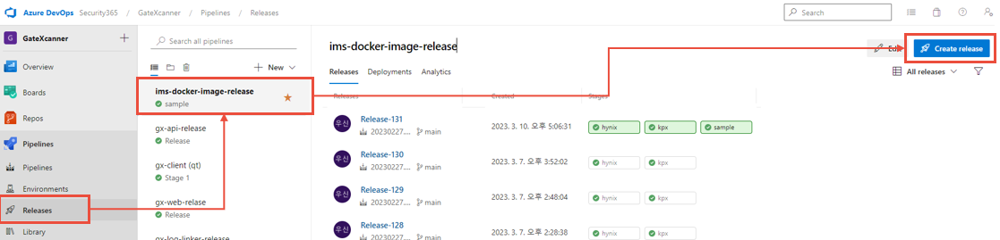  
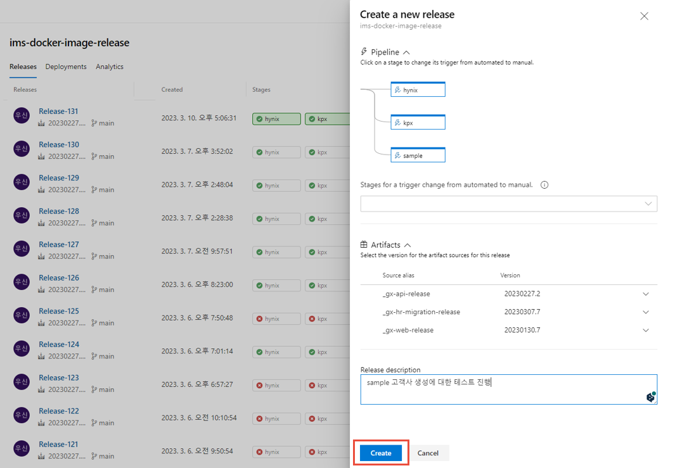  

### 동작 상황 모니터링

현재 동작중인 또는 동작이 완료된 Pipeline의 **성공, 경고, 에러** 발생 여부와, 발생 원인들을 로그 형식으로 확인할 수 있습니다.

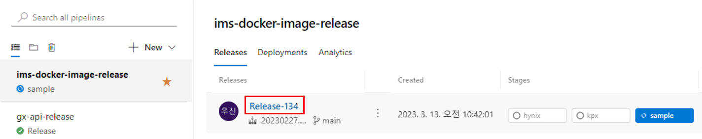  
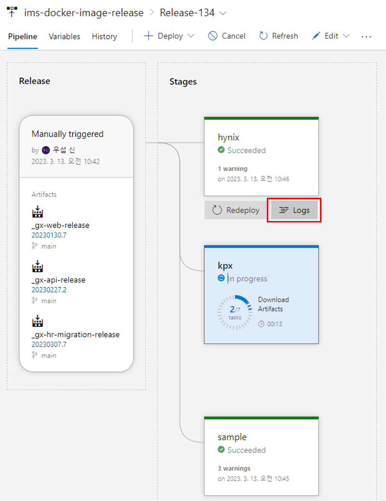  
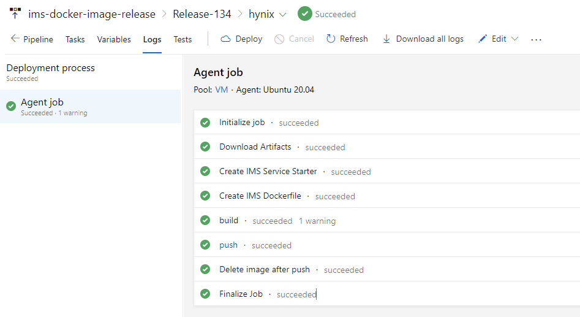  

정상적으로 Pipeline이 완료되면 최종적으로 모든 **Stages** 들이 **Succeeded** 로 변하게 됩니다.

### ACR에 업로드된 Docker Image 확인

**https://portal.azure.com/** 경로를 들어가서 권한이 있는 계정으로 로그인하면 아래와 같이 ACR에 업로드된 Docker Image 리스트를 확인할 수 있습니다.

저희가 테스트한 Pipeline이 정상적으로 완료되면서 **"sample"** 이라는 docker repository 가 업로드된 걸 확인할 수 있습니다.

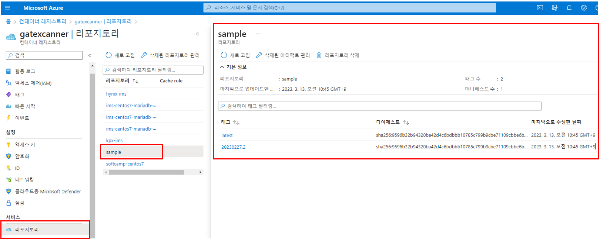

---

## Tester 입장에서 Docker Image 가져다 사용하기

자 지금까지는 pipeline 관리자 입장에서 설명했다면 이제 만들어진 Docker Image가져다 테스트하는 방법을 다뤄보겠습니다.

주의해야할 점은 **컨테이너 실행 시 꼭 필수 옵션들을 입력해야 한다는 점** 입니다.

사전에 준비할 사항은  **호스트 OS로 사용될 Docker 가 설치되어있는 리눅스** 환경입니다.

### 테스트할 Docker Image PULL

먼저 호스트 OS에서 명령어를 이용하여 테스트할 Docker Image를 PULL합니다.

```bash
sudo docker pull gatexcanner.azurecr.io/sample:latest
```

```bash
# 최초 다운로드시 아래와 같이 동작
latest: Pulling from sample
f34b00c7da20: Already exists
b1878569ed46: Already exists
a6b5e9714f28: Already exists
a8c48ecabdee: Already exists
32717d094fb4: Already exists
9139d8fa880a: Already exists
c2c83b3a59df: Already exists
baa008ff85e6: Already exists
98476978e429: Already exists
e254983efed8: Already exists
66f12df588e7: Already exists
c92eaf1242ff: Already exists
74abb8b9c57e: Pull complete
fc0cce5c4017: Pull complete
c2bf4d7bd6ee: Pull complete
1d1259ec7d52: Downloading [===============>                                   ]  23.23MB/74.21MB
201c23db1e4d: Download complete
1ba332db62a3: Downloading [=========================================>         ]  37.16MB/45.23MB
1f8f8dfac4db: Download complete
4bae21a53085: Download complete
458a4b604579: Download complete
32565140c54b: Downloading [==>                                                ]  14.58MB/352.1MB
72b8863bf0bd: Waiting
0e6dd61403ba: Waiting
c92e0d690303: Waiting
97134c794d05: Waiting
ab971958d767: Waiting
7958b47b988e: Waiting
97113d7e9a24: Waiting
053aaa2fee99: Waiting
829bfe6301a8: Waiting
91a7ad4a0c0a: Pulling fs layer
```

환경에 따라 다운받는데 시간이 좀 걸릴 수 있으니 차분하게 기다려 봅니다.

정상적으로 다운이 완료되면 아래와 같이 표시됩니다.

```bash
Digest: sha256:9596b32b94320ba42d4c6bdbbb10785c799b9cbe71109cbbe6b438a759f73922
Status: Downloaded newer image for gatexcanner.azurecr.io/sample:latest
gatexcanner.azurecr.io/sample:latest
```

### 컨테이너 실행

자 이제 다운로드된 컨테이너를 실행시켜보겠습니다.
이때 **환경변수와 포트바인딩이 필수**이니 꼭 주의해주세요!

```bash
# sudo docker run -e HOST_IP=<호스트 OS IP> -e SERVICER_PORT=<Nginx가 listening중인 PORT> -it -p <호스트쪽 Mapping될 PORT>:<Nginx가 listening중인 PORT> --name <컨테이너 이름> <Docker Image 이름>

sudo docker run -e HOST_IP=10.81.10.175 -e SERVICE_PORT=9000 -it -p 9000:9000 --name sample-ims-test gatexcanner.azurecr.io/sample:latest
```

정상적으로 컨테이너가 실행되면 아래와 같이 터미널이 변경됩니다.

```bash
[root@<컨테이너 ID> /]
```

### Service Starter 실행

자 이제 컨테이너에 필요한 서비스들을 실행시켜보겠습니다. 앞서 말씀드린 것 과 같이 도커 컨테이너는 **System daemon 을 사용할 수 없습니다(사용시 보안 위험 존재)** 그렇기 때문에 Pipeline에서 생성한 **Service starter shell** 을 이용하겠습니다.

```bash
cd /home/softcamp
```

```bash
ls
```

```bash
GateXcanner        elastic_design.tar                        elasticsearch_init.sh   mariadb
GateXcannerApiSvr  elasticsearch-7.17.6                      gx-hr-migration         nginx-1.18.0-2.el7.ngx.x86_64.rpm
elastic_design     elasticsearch-7.17.6-linux-x86_64.tar.gz  ims-service-starter.sh
```

위와 같이 /home/softcamp 경로에 가보면 여러 파일들이 존재하는데 이중 **"ims-service-stareter.sh"** 을 실행시키면 됩니다.

```bash
./ims-service-starter.sh
```

실행시키면 많은 텍스트들이 표준출력으로 주르륵 찍힐텐대 **GateXcanner 제품에 대하여 잘 모르시는 분은** 최종적으로 **`"INFO  2023-03-13 02:51:23[main] [SystemController:151] - 서비스 실행 완료"`** 라는 텍스트가 찍혔는지 확인하시면 됩니다.

 **GateXcannerApiSvr가 초기화(기본 역할 생성, 기본 아이디 생성 등) 작업으로 인하여 실행되는데 시간이 좀 걸립니다. 스크립트 실행 후 차 한잔 하셔도 됩니다. (모든 작업이 완료되는대 대략 3~5분 소요)**

자 실행이 완료되었으면 실제로 외부에서 서비스가 동작하는지 확인해봅니다.

### 실제 Service 동작 여부 확인

컨테이너를 실행할때 사용한 호스트 OS와 바인딩 된 포트번호로 외부에서 웹 서비스를 요청해보겠습니다.

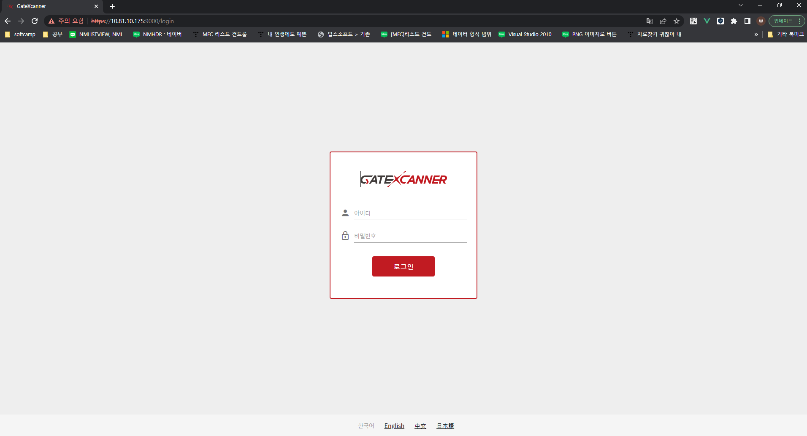  

자 페이지는 정상적으로 얻어집니다.

그럼 **API 서비스와, Elasticsearch** 의 정상 동작 여부를 확인하기 위하여 로그인을 해볼까요?

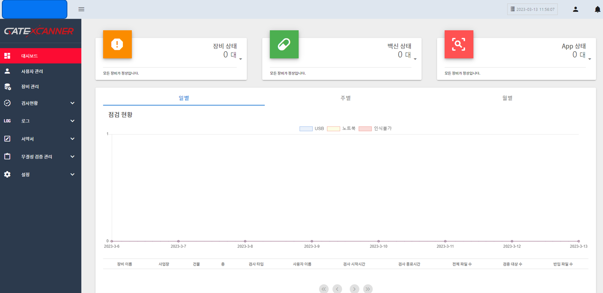  

로그인도 정상적으로 이뤄지는것을 확인했습니다.

이렇게 로그인까지 완료되면 서비스들은 정상적으로 실행된 것이고, 이제 테스트를 진행하며 서비스 기능 자체의 비정상 동작 들을 확인할 수 있습니다.

---

## 마무리

지금까지 온프레미스 제품인 "GateXcanner IMS 고객사별 테스트환경 Docker Image 생성 및 배포 Pipeline" 알아보았습니다.

관련하여 문의 사항 또는 문서의 미흡한 점(오탈자, 실제와 다름 등)을 알려주시면 적극적으로 회신 및 수정하도록 하겠습니다.

감사합니다.

