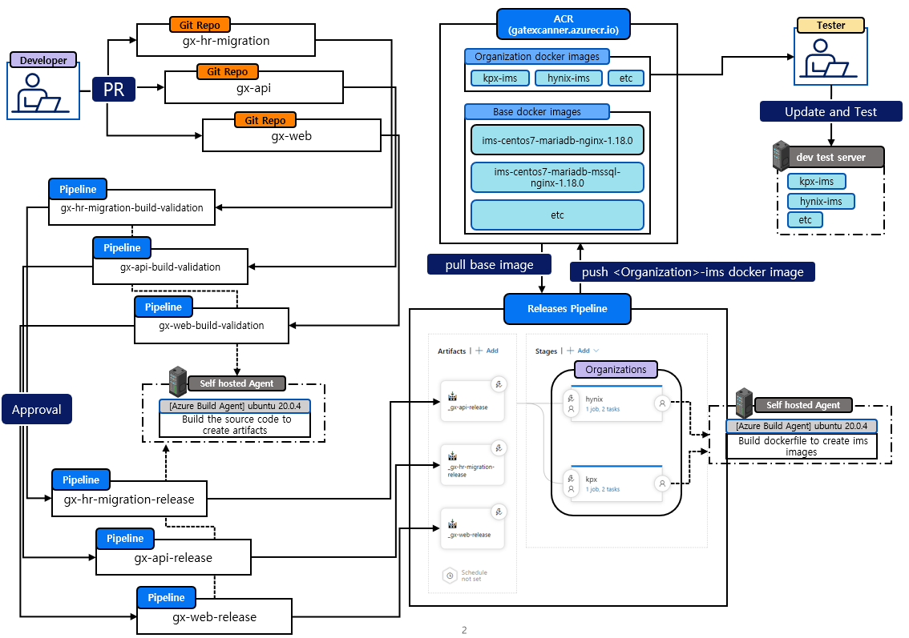

# GateXcanner 고객사별 테스트환경 Docker Image 생성 및 배포 Pipeline 설명

## 개요 : 도커 이미지로 배포하는게 아닌 서비스에 갑자기 웬 도커??

GateXcanner 제품은 온프레미스 제품으로, 실제 고객사에 배포될 때 단순히 실행 파일 및 Config 파일로 배포됩니다. 한데 갑자기 왜 도커가 튀어나왔을까요.

### 고객사마다 다른 환경

온프레미스의 제품들은 고객사마다 설치된 환경이 다를 수 있습니다.

예를들어 아래와 같이 3개의 고객사가 존재한다 할 때 각 고객사 환경을 예로 들어보겠습니다.

|환경|A 고객사|B 고객사|C 고객사|
|---|---|---|---|---|
|OS|Centos 7|RedHat 8|Centos 7|
|JDK|11|14|17|
|DB|MS-SQL|MariaDB|Postgresql|
|Elasticsearch Version|7.8.1|7.17.6|8.0.1|
|Nginx Version|1.18.0|1.20.0|1.20.2|
|API Version|1.0.0|1.0.4|1.3.3|
|CLIENT Version|2.0.1|2.0.0|2.1.5|

위와 같이 각각의 고객사가 서로 다른 환경을 지니게될 경우가 존재합니다.
물론 최대한 동일한 형상을 유지해야겠지만 고객사의 요구로 인하여 어쩔 수 없이 하나, 두개 변경하다보면 기준 환경에서 많이 달라지게 됩니다.

문제는 이렇게 고객사 환경이 시시각각 달라지면 내부 테스트는 이를 따라갈 수 없다는 점 입니다.

**"고객사 수 만큼 개발 환경 VM을 만들고 관리하면 되지 않나?"**

라는 의문이 들 수 있습니다.

불가능한건 아닙니다. 하지만 VM으로 고객사 형상과 맞는 개발 환경구성에는 아래와 같은 문제점들이 존재합니다.

### 고객사별 개발 환경을 VM으로 관리하면 발생하는 문제점

#### 많은 용량 차지

VM을 사용해보신 분들은 알겠지만 이미지 파일 하나당 상당히 큰 용량이 필요합니다.
이런 VM 이미지를 고객사마다 생성하게되면 많은 저장공간을 차지하게됩니다.

#### 생성하는데 많은 시간 소모

VM 생성은 OS를 직접 설치하게됩니다. 컴퓨터 OS를 직접 설치하고 고객사와 동일한 환경으로 설정값들을 맞춰주는 과정은 많은 시간을 소모하게 됩니다.

#### 변경된 형상에 대한 히스토리 관리의 어려움

특정 고객사가 빈번하게 형상 변경이 된다고 할 경우
이 고객사가 어떠한 변화 흐름을 가져왔는지, 변화에 흐름동안 서비스들이 정상적으로 동작하였는지 등 시간이 지남에 따라 확인이 어려워집니다.

물론 스냅샷이라는 기능이 있지만 스냅샷은 가상 머신의 운영 체제, 라이브러리, 애플리케이션, 데이터 등 모든 것을 포함하는 데이터이기 때문에 용량이 상당합니다 **많은 용량 차지** 라는 문제점이 발생하게됩니다.

#### 내,외부로 형상 공유의 어려움

이미지 파일은 보통 수십 기가바이트로 이를 네트워크로 전달하고자 할 경우 상당항 시간이 소요되며, 물리적으로 공유할때도 그 크기에 맞는 저장장치를 구해야하기 때문에 어려움이 발생합니다.

#### 자동화의 어려움

저희가 내부에서 사용하는 Azure DevOps 를 포함하여 CI/CD 를 도와주는 여러 서비스들에서 VM을 통한 배포 방식은 기본으로 지원하지 않습니다. 그렇기 때문에 VM을 통한 CI/CD 기능을 하나하나 전부 만들어야하는 어려움이 발생합니다.

#### 무수히 많이 추가되는 고객사

제품이 팔릴때 마다 고정된 고객사가 아닌 새로운 고객사가 추가되는 경우가 빈번합니다.
이 때마다 VM을 만들어내기에는 시간적 리소스가 많이 소모됩니다.

위와 같은 문제로 인하여 VM으로 관리하기에는 현실적인 문제들이 발생하기 때문에, 다른 방법으로 **도커** 가 선택됩니다.

### 도커를 채택하면서 해결되는 문제점

도커를 사용하게되면서 위 문제들은 해결됩니다.

- **많은 용량 차지 ->**  도커는 **호스트 시스템의 리눅스 커널을 공유**하기 때문에 컨테이너 간에 파일 시스템을 공유하여 VM이미지에 비해 상대적으로 굉장히 적은 용량을 쓰게 됩니다. 또한 도커의 특성으로 도커 허브등에 이미지를 저장할 경우 이전 이미지와 중복되는 이미지 레이어들은 한번만 저장되기 때문에 상대적으로 적은 용량이 필요합니다.
- **생성하는데 많은 시간 소모 ->** 도커는 이미지 컨테이너를 생성하는 프로세스임으로 VM과 같이 전체 운영 체제를 가상화하지 않아 생성 속도가 빠릅니다
- **변경된 형상에 대한 히스토리 관리의 어려움 ->** VM을 이용한 스냅샷은 큰 용량을 차지하지만 자체 도커 허브등을 구축하여 사용할 경우 도커의 이미지 레이어 특성으로 인하여 VM 스냅샷보다 적은 용량으로 히스토리를 관리할 수 있습니다.
- **내,외부로 형상 공유의 어려움 ->** 도커 허브를 통하여 인터넷이 가능한 어느곳에서든 이미지를 다운받을 수 있게됩니다.
- **자동화의 어려움 ->** 시중에 사용되는 여러 자동화 서비스들이 도커에 대한 기능들은 대부분 갖추고 있기 때문에 별도의 기능들을 만들어낼 필요성이 적어집니다.
- **무수히 많이 추가되는 고객사 ->** Base 이미지만 존재할 경우 DockerFile통해 손쉽게 추가되는 고객사 환경을 만들어낼 수 있습니다.

---

이제 GateXcanner 제품을 어떻게 도커로 설계했는지 보여드리겠습니다.

## GateXcanner 고객사별 테스트 환경 자동화 아키텍처

  

- **Developer** : 소스코드를 수정하게되는 개발자입니다. GitRepo 에 본인이 수정한 소스코드를 **PR(PullRequest)** 합니다.
- **GitRepo** : 소스코드 관리를 위한 AzureDevOps 프로젝트별 소스코드 저장소입니다. 버전 및 변경 이력등을 저장할 수 있습니다.
- **Pipelines & Release Pipeline** : Azure DevOps의 Pipeline은 소프트웨어 개발 및 배포 프로세스를 자동화하는 CI/CD(Continuous Integration/Continuous Deployment) 툴입니다. Pipeline을 사용하면 소스 코드 변경 사항을 자동으로 빌드하고, 테스트하고, 배포할 수 있습니다. 여기서 **빌드**와 **배포** 개념을 분리한 두 가지 유형의 Pipeline이 존재하는데 **빌드 : pipeline** 과 **배포 : ReleasePipeline** 이 있습니다.
- **Pipelines** : **빌드** 전용 파이프라인 입니다. 소스코드를 가져와 컴파일, 빌드 및 테스트를 수행합니다. 개발자들이 새로운 코드를 작성할 때마다 자동으로 빌드를 수행하여 릴리스를 준비하며, 일반적으로 CI(Continuous Integration) Pipeline입니다.
- **Release Pipeline** : **배포** 전용 파이프라인 입니다. **Pipeline 에서 생성된 빌드 아티팩트**들을 가져와서 릴리스 및 배포할 수 있습니다. 이 Pipeline은 일반적으로 DevOps 엔지니어, 운영팀 또는 릴리스 매니저 등이 사용하는 CD(Continuous Deployment) Pipeline입니다.
- **ACR(Azure Container Registry)** : Microsoft Azure에서 제공하는 완전 관리형 컨테이너 이미지 레지스트리 서비스입니다. 도커 이미지 관리용이라고 보시면 되겠습니다.
- **Self hosted Agent** : Self-hosted agent는 조직의 **서버, 가상 머신 또는 컨테이너**에서 실행되는 Azure Pipelines agent입니다. Self-hosted agent는 조직의 네트워크에서 빌드 및 배포 작업을 수행하므로 클라우드 기반 빌드 및 배포 서비스를 사용할 수 없는 경우에도 사용할 수 있습니다.
- **Tester** : ACR에 존재하는 고객사별 이미지를 이용하여 테스트 작업을 진행하는 인원입니다.
- **Dev test server** : 개발 단계에서 테스트를 진행하기 위한 테스트 서버입니다. 고객사별 도커 컨테이너를 항상 실행상태로 유지하여 언제든 테스트가 가능하도록 합니다.