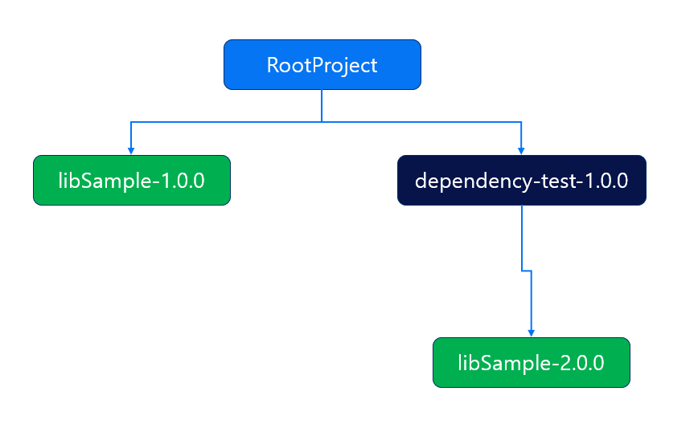

# java 의존성 충돌 테스트 (use Gradle)

gradle을 이용한 java 프로젝트에서 문뜩 내가 사용하고 있는 라이브러리와, 내 프로젝트가 사용하는 라이브러리가 동일한 라이브러리를 사용하고 있으면 어떻게 될까? 궁금하여 테스트하였습니다.

<!--more-->

## 의존성 충돌을 위한 구조

  

- RootProject : 최상위 프로젝트입니다.
- libSample : 의존성 충돌을 일으키기 위해 1.0.0과 2.0.0으로 나눠진 두개의 버전을 준비합니다.
- dependency-test : root 프로젝트와는 다른 버전의 libSample 을 의존하도록 하여 의존성 충돌을 발생시킵니다.

### RootProject 의존관계

```groovy
// build.gradle
dependencies {

    // ~~~

    implementation files('./libs/lib-sample-1.0.0.jar')
    implementation files('./libs/dependency-test-1.0.0.jar')

    // ~~~
}
```

### dependency-test-1.0.0 의존관계

```groovy
// build.gradle
dependencies {

    // ~~~

    implementation files('./libs/lib-sample-2.0.0.jar')

    // ~~~
}
```

**RootProject** 는 **`lib-sample-1.0.0.jar`** 을 의존
**dependency-test** 는 **`lib-sample-2.0.0.jar`** 을 의존

---

## 의존성 충돌을 발생시키는 코드 구성

먼저 lib-sample-1.0.0 과 lib-sample-2.0.0 의 호출되는 함수는 같으나 내부 기능이 다르도록 만들어 보겠습니다.

### lib-sample-1.0.0

```java
public class LibSample {

    private String value;

    public LibSample() {
        this.value = "test";
    }

    public String getValue() {
        return value;
    }

    public void setValue(String value) {
        this.value = value;
    }
}

```

### lib-sample-2.0.0

```java
public class LibSample {

    private int value;

    public LibSample() {
        this.value = 1;
    }

    public int getValue() {
    return value;
    }

    public void setValue(int value) {
    this.value = value;
    }
}

```

위와 같이 value 라는 변수명, LibSample이라는 클래스명, getValue, setValue등 이름은 동일하나 

**`2.0.0`** 버전은 **`int`** 타입을,
**`1.0.0`** 버전은 **`String`** 타입을 사용하도록 차이점을 두었습니다.

자 이제 빌드를 하여 **lib-sample-2.0.0.jar** 를 사용하는 **dependency-test** 의 코드를 작성해보겠습니다.

### dependency-test-1.0.0

```java

public class DependencyTest {

    public LibSample getLibSample() {

        LibSample libSample = new LibSample();
        libSample.setValue(100);

        return libSample;
    }
}

```

**`dependency-test-1.0.0`** 는 **`lib-sample-2.0.0.jar`** 을 의존하기 때문에 **`int setValue(int value)`** 와 같이 **`int`** 타입을 기준으로 동작합니다.

그렇기 때문에 **`libSample.setValue(100);`** 과 같이 **value** 가 **100**으로 셋팅된 **libSample 객체**를 반환하도록 하겠습니다

자 그럼 이제 **`String`** 타입을 기준으로 동작하는  **`lib-sample-1.0.0.jar`** 과 **`dependency-test-1.0.0`** 를 동시에 의존하는 **`RootProject`** 의 코드를 작성해보겠습니다.

### RootProject

```java
public static void main(String[] args) {

    DependencyTest dependencyTest = new DependencyTest();

    LibSample libSample = dependencyTest.getLibSample();

    System.out.println(libSample.getValue());
}
```

자 위와 같이 RootProject의 코드를 작성하고 동작을 시킬 때 어떻게 되는지 알아봅시다.

### 예상

먼저 이상적인 결과를 예상을 해보자면 에러 없이 **"100"** 이라는 결과가 찍히길 원합니다.

그렇게 동작할려면 **`DependencyTest`** 아무 문제 없이 **`lib-sample-2.0.0.jar`** 를 사용할 수 있으면 됩니다.

### 하지만 현실은...

동작시키면 아래와 같은 에러를 마주하게 됩니다.

```bash
...
Exception in thread "main" java.lang.NoSuchMethodError: 'void libsample.LibSample.setValue(int)'
...
```

### 왜 setValue(int) 를 못찾지??

**`int`** 타입 기반의 **`setValue()`** 를 찾지 못하여 에러가 발생했습니다.

그렇다면 **`lib-sample-2.0.0.jar`** 를 사용하지 않고 **`lib-sample-1.0.0.jar`** 을 사용했다는 것인데 왜 이렇게 되었을까요?

#### 동일한 패키지에 동일한 클래스명은 단 하나만 가능

java에서는 동일한 패키지 경로에 동일한 클래스명은 **단 하나**만 존재할 수 있습니다.

위 예시의 경우를 보면 **`lib-sample-1.0.0.jar`** 에도 **`LibSample`** 이라는 클래스가, **`lib-sample-2.0.0.jar`** 에도 **`LibSample`** 이라는 클래스가 동일한 패키지 경로에 존재합니다.

그렇기 때문에 둘중 단 하나의 클래스만 선택될 수 있으며, 이 선택의 기준은 **최상위 프로젝트와 가까운 클래스** 가 선택됩니다.

**`lib-sample-1.0.0.jar`** 의 경우 최상위 프로젝트인 RootProject가 바로 의존하고 있기 때문에 채택된 것 입니다.

#### 순서가 반대라면?

만약 반대로 RootProject가 **`lib-sample-2.0.0.jar`** 를 의존하고 **`DependencyTest`** 가 **`lib-sample-1.0.0.jar`** 을 의존했을 경우에는 **`lib-sample-2.0.0.jar`** 가 선택되었을겁니다.

---

## 해결 방법은?

사실 위 예시와 같을 경우 해결 방법이 없습니다...

**강제로 공통된 버전을 사용하도록 하는 방법** 이 존재하나 둘 중 하나는 오류가 발생할 가능성이 높기 때문에 추천하지 못하는 방식입니다.

결국은 호환되는 버전의 라이브러리를 공통적으로 사용하는 버전을 찾아서 **다른 하나를 다운그레이드 하던지, 아니면 업그레이드 하던지 하여 안전하게 버전을 맞춰야합니다.**


