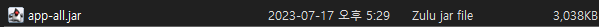
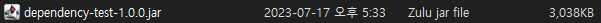
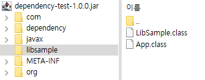

### 빌드 결과물이 의존성을 포함하지 않음!

간단합니다.  **`RootProject`** 는 **`lib-sample-1.0.0.jar`** 을 의존하고 있기 때문에 **`lib-sample-2.0.0.jar`** 이 존재하건 말건 신경 안씁니다. 필요성을 아예 모르기 때문이죠,

그렇기 때문에 **`lib-sample-2.0.0.jar`** 을 사용할려면 **`dependency-test-1.0.0`** 자기 자신이 직접 챙겨야합니다.

즉, **`dependency-test-1.0.0`** 내부에 **`lib-sample-2.0.0.jar`** 를 포함하고 있어야합니다.


### shadow jar를 이용한 의존성 포함 빌드

그럼 빌드 시 의존성을 포함하여 빌드해야하는데 방법이 있을까요?

일반적인 방식으로는 안되고 **shadow jar** 라는 플러그인을 사용해야합니다.

```groovy

plugins {
  id 'com.github.johnrengelman.shadow' version '7.0.0'
  id 'java'
}

```

gradle에서는 요런식으로 플러그인을 사용할 수 있습니다.

플러그인을 추가 후 `gradlew shadowJar` 를 통해서 task를 호출하면 


  

과 같은 결과물이 생성됩니다.

저 `app-all.jar` 라는 기본 이름이 마음에 안들경우

```groovy
shadowJar {
   archiveBaseName.set('dependency-test')
   archiveClassifier.set('')
   archiveVersion.set('1.0.0')
}
```

와 같이 `shadowJar` task를 정의해주면 됩니다.

그런 다음 다시 task를 호출하면

  

과 같이 jar의 이름을 변경할 수 있습니다.

이 .jar파일을 열어보면 아래와 같이 **LibSample** 이 포함된걸 확인할 수 있습니다.

  

### 자 그러면 shadowJar를 사용한 빌드 결과물로 다시 테스트
