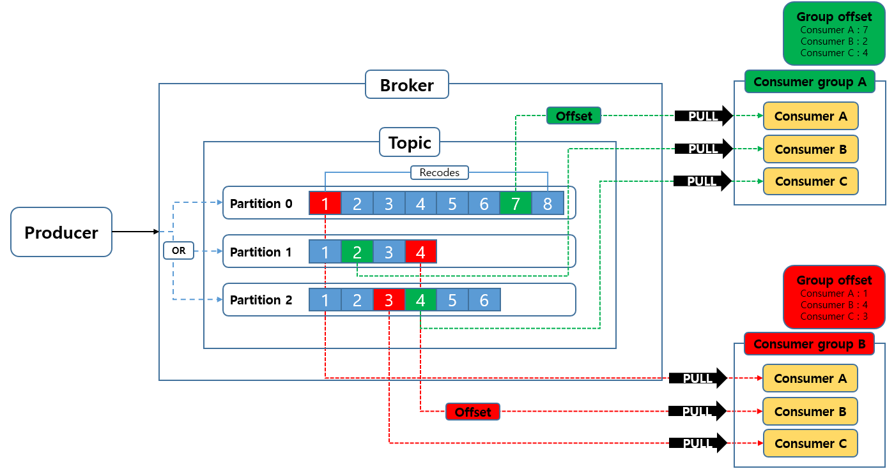

## 메세지 큐 (Message Queue)

메세지를 임시 저장하는 공간이라고 보면 됩니다.

생성된 메세지를 바로 처리 할 수 없는 경우가 발생할 수 있으니

생성된 메세지를 임시 저장소에 저장해두고 이 메세지를 수신하는 측이 현재 메세지를 받을 수 있는 상황이면 뒤 늦게 꺼내갈 수 있도록 하는 역활을 합니다.

kafka는 이 메세지 큐의 한 종류 입니다.

---

## kafka 아키텍처

그럼 kafka 가 어떻게 구성되어있는 알아보겠습니다.

### publisher, consumer, broker

비동기 모델을 사용해보셨거나, 반응형 등에 공부해봤던 분들은 익숙하실 수 있습니다.

* **publisher** : 메세지를 생성하는 역할입니다.
* **consumer** : 메세지를 소비하는 역할입니다.
* **broker** : 메세지를 저장하고, publisher 와 consumer 간의 통신을 중개해주는 역할입니다

여기서 **broker** 라는 개념이 좀 생소하실 수 있습니다.
영화나 드라마에서보면 큰 규모의 거래나, 어두운 뒷거래 시 직접적인 판매자와 소비자가 1:1로 거래하는게 아니라 중개자를 두고 중개자의 조율하에 거래를하게되는데 그때 사용하는 broker 와 같은 의미입니다.

우리가 "출판사" 로 부터 신간의 책들을 구독해서 읽는 현실의 예를 들어보겠습니다.

1. **작가(publisher)** 가 **최신 it** 관련 원고를 작성 후 **출판사(broker)** 에게 작성된 원고를 넘깁니다.
2. **출판사(broker)** 는 작성된 원고를 **it** 분야를 구독하고 있는 **구독자(consumer)** 들에게 전달합니다.
3. **구독자(consumer)** 는 **출판사(broker)** 로 부터 구독하고 있던  **it** 관련 최신 책을 전달 받아 소비합니다.

여기서 특징은

- 작가와 구독자가 1:1로 거래를 하지 않습니다
- **it** 라는 주제의 책을 작성하는 작가는 **N명** 일 수 있고, **it** 라는 주제를 구독하는 구독자 역시 **N** 명일 수 있습니다

자 큰 개념은 이렇게 간단합니다.
이 개념은 대부분의 **메세지 큐** 가 공통적으로 갖는 아키텍처입니다.

자 그럼 여기서 좀더 디테일한 정보를 알아보겠습니다.

---

## 아키텍처 자세히 알아보기

- **topic** : 메세지 저장소
- **partition** : 각 토픽 당 데이터를 분산 처리하는 단위
- **recode** : 메세지가 관리되는 단위
- **offset** : 파티션 내의 각 레코드를 고유하게 식별하는 순차적인 ID
- **consumer group** : consumer group 은 topic 데이터를 처리하는 consumer들의 집합
- **rebalancing** : 컨슈머 그룹 내의 각 컨슈머의 파티션 소유권 이관 작업

**topic** 이란 브로커가 **publisher** 로 부터 전달받은 메세지를 저장하는 **메세지 저장소** 입니다

이때 **topic** 은 내부적으로 **partition** 들로 구성되는데,
**kafka** 에서 생성된 메세지들은 **recode** 라는 단위로 만들어져서 이 **partition** 에 **순서대로** 차곡차곡 **순차적인 Offset을 부여받고 저장됩니다**

이 **offset**은 컨슈머가 다음에 읽어올 레코드가 무엇인지 알 수 있도록 이정표 역할을 합니다.

이 offset을 잘 관리해야 데이터의 중복 및 누락을 방지할 수 있기에 굉장히 중요한 키워드입니다.

 

글로만 이해하기에는 추상적일 수 있으니 그림으로 그려봤습니다.

그림을 참고해보면, 각각의 Cousumer A, B, C들이 Partition 0, 1, 2 와 1:1 로 맵핑됩니다.
그렇다면 Consumer 별로 별도의 Offset 을 기억해야한다는 것인데 이 offset의 기억은 consumer가 아닌 **consumer group** 단위로 기억합니다.

만약 **consumer group** 에 속하지 않는 consumer 의 경우, offset이 기억되지 않아 이전에 읽어온 데이터 다음의 데이터를 읽는데 문제가 발생할 수 있습니다.

이에 대해서는 consumer group 에 대하여 좀 더 자세히 알아보면서 설명하겠습니다.

### consumer group

간단하게는 **topic 데이터를 처리하는 consumer들의 집합** 입니다.

