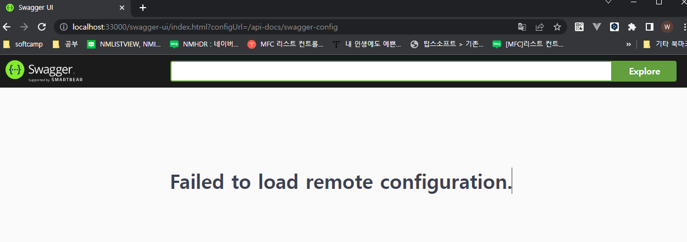
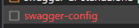
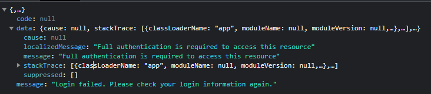
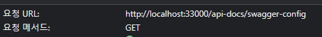

## 일단 결론

- swagger관련된 url이 모두 `swagger` 라는 키워드로 시작되는건 아니다. spring security config 에서 사용되는 `URL`에 대해서 꼼꼼히 체크 하자

## 내용

Spring security 가 적용된 프로젝트에 swagger 를 적용하려하니, 아래 이미지와 같이 swagger 페이지에서 오류가 발생하였습니다.

  

F12 눌러서 오류난게 뭐가 있나 찾아보았더니 

  

"swagger-config" request에 빨간불이 똭.

  

response에 찍힌 message 부터 security 로 인하여 문제가 발생한 것 같은 느낌이 팍팍듭니다.

가장 먼저 든 생각이 security config에서 url에 swagger를 위한 url에 대하 허용을 안해놨던가? 라는 생각이 들어서 확인해보았습니다.

### Security Config 에 Swagger Url 허용

```java

    .antMatchers("/swagger-ui.html").permitAll().antMatchers("/swagger/**").permitAll()
    .antMatchers("/swagger-ui/**").permitAll()

```

확인해보니 Url 처리도 되어있었습니다.

`http://localhost:33000/swagger-ui/index.html?configUrl=/api-docs/swagger-config` 라는 url로 요청했기에 `.antMatchers("/swagger-ui/**").permitAll()` 에 해당되어 무사히 완료되었어야 합니다.

### Url 허용 문제는 아닌 것 같은데.. 서버 로그 확인해보기

이제 서버쪽 로그를 Debug수준으로 바꾸고 확인해보았더니 Swagger 접근 시도 시 `JWT String argument cannot be null or empty` 이라는 로그가 반복적으로 찍혔습니다.

찾아보니 `JwtParser`의 `parse()` 함수에서 찍은 메세지인데 애초에 Swagger Url 에서는 Jwt에 대한 유효성 체크를 건너뛰길 원해서 `.antMatchers("/swagger-ui/**").permitAll()` 를 지정했던 것 인데, 뭔가 예상과는 다르게 Jwt 유효성 체크를 건너뛰지 않고 있는 것으로 보입니다.

```java
    .antMatchers("/swagger-ui/**").permitAll()
    //////////////////////////////////////////////////////////
    .anyRequest()
    .access("@jwtTokenProvider.validateToken(request.getHeader(\"Authorization\"))").and()
```

실제로 Security Config 에서 swagger ui 예외처리 후 바로 하단에 `.anyRequest().access("@jwtTokenProvider.validateToken(request.getHeader(\"Authorization\"))").and()` 를 추가하여, **상단에서 명시되지 않은 나머지 모든 Url에 대해서 JWT 유효성 체크를 하고자 했습니다.**

그렇다면 왜 `.antMatchers("/swagger-ui/**").permitAll()` 를 건너뛰고 `validateToken()` 가 호출되었는지 브레이크 포인트를 걸어가며 열심히 찾던 중...

엇.. Filter에서 체크한 url이 `/swagger-ui/` 로 시작하지 않고 `/api-docs/` 로 시작하는걸 발견했습니다..

### 기승전 휴먼 에러

  

이럴수가.. 실제로 request url이 다릅니다.. swagger 이기 때문에 모든 url이 `swagger-ui` 로 시작할거라는 이 말도 안되던 착각이 불러온 실수였습니다.

실수를 깨닫고

```java
    .antMatchers("/swagger-ui/**").permitAll().antMatchers("/api-docs/**").permitAll()
    //////////////////////////////////////////////////////////
    .anyRequest()
    .access("@jwtTokenProvider.validateToken(request.getHeader(\"Authorization\"))").and()
```

와 같이 수정해줬더니 잘만 동작합니다..

