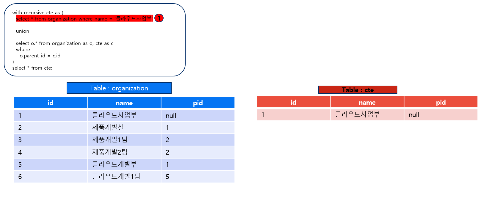
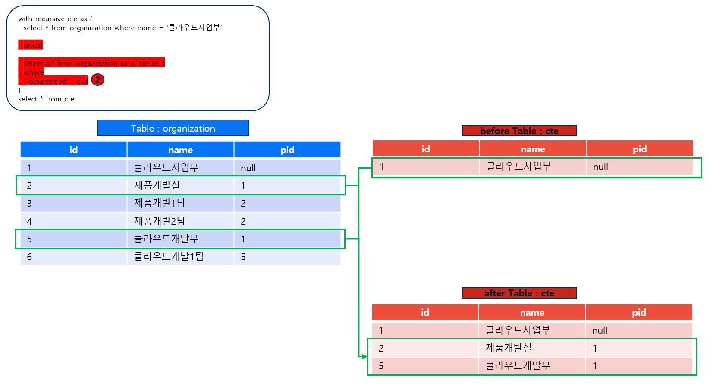
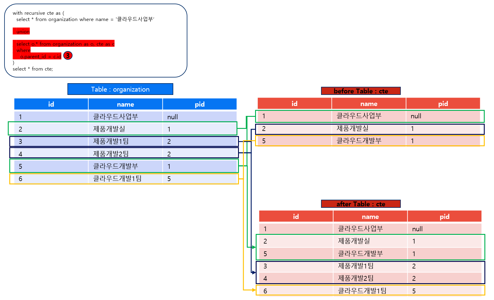

"조직" 이라는 정보의 경우 계층형 구조를 갖을 가능성이 높다.
예를 들어 "OOO사업본부 000부서 000팀" 과 같이 사업본부 > 부서 > 팀과 같이 데이터가 존재할 수 있다.
이 데이터를 Spring jpa를 이용하여 db에 저장,조회 등을 할 때 어떻게 해야하는지 알아보았습니다.

<!--more-->

## with recursive (재귀쿼리)

### 재귀쿼리가 실행되는 순서를 그림으로 확인해보자

  

  

  
