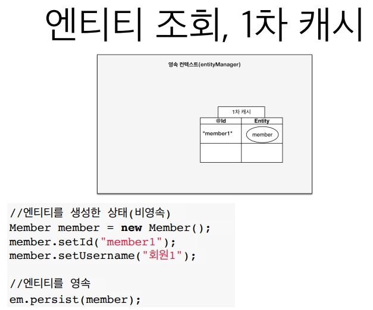
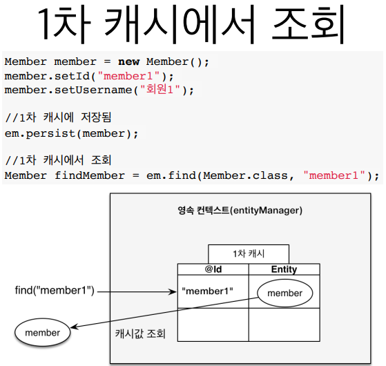
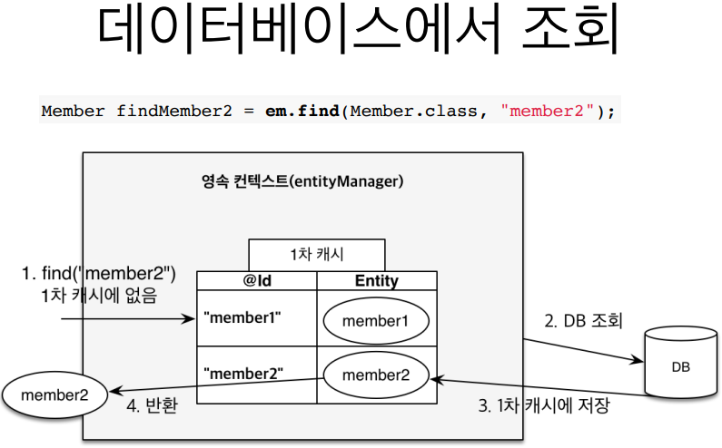
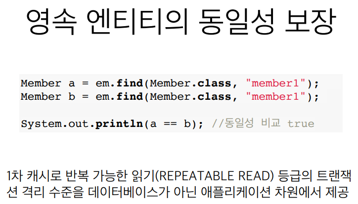
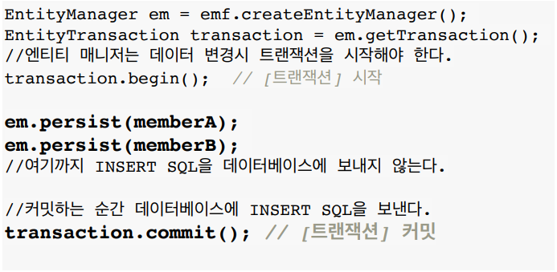
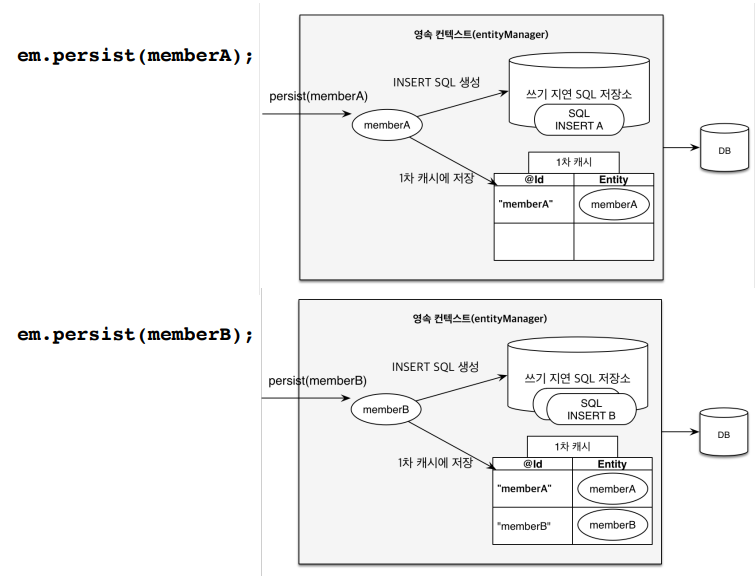
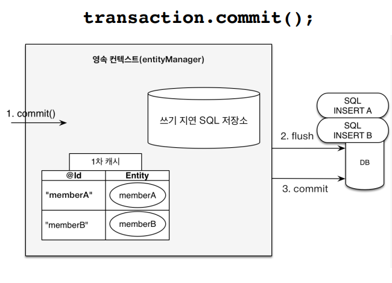
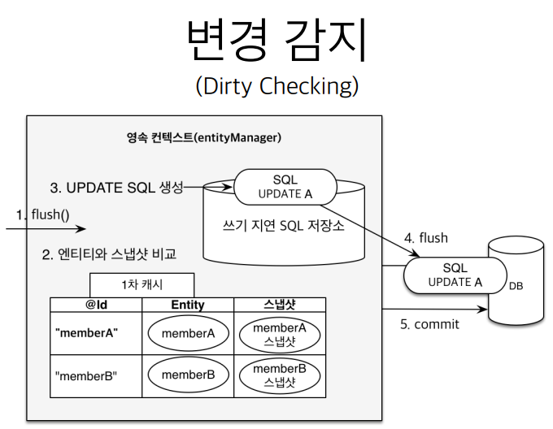
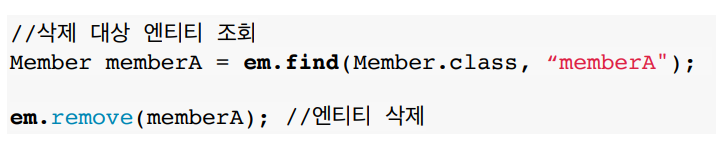

김영한님의 인프런 jpa 강의를 듣고 정리한 내용입니다.

<!--more-->

## JPA에서 가장 중요한 2가지

- 객체와 관계형 데이터베이스 매핑하기 (Object Relational Mapping)
- **영속성 컨텍스트**

---

## 영속성 컨텍스트 1

- JPA를 이해하는데 가장 중요한 용어
- **"엔티티를 영구 저장하는 환경"** 이라는 뜻
- **`EntityManager.persist(entity);` : Entity 를 DB에 저장하는게 아니라 영속성 컨텍스트에 저장하는 것이다**

---

## 엔티티 매니저? 영속성 컨텍스트?

- 영속성 컨텍스트는 논리적인 개념
- 눈에 보이지 않는다.
- 엔티티 매니저를 통해서 영속성 컨텍스트에 접근

**엔티티 매니저 생성 시 내부적으로 PersistenceContext(영속성 컨텍스트) 가 생성된다.**

---

## 엔티티의 생명주기

### 비영속 (new/transient)

영속성 컨텍스트와 전혀 관계가 없는 **새로운** 상태

예시 : JPA 전혀안쓰고 그냥 Entity 객체만 생성해놓는 것

### 영속 (managed)

영속성 컨텍스트에 **관리**되는 상태

### 준영속 (detached)

영속성 컨텍스트에 저장되어았다가 **분리**된 상태

### 삭제 (removed)

**삭제**된 상태

## 영속성 컨텍스트의 이점 (DB중간에 뭔가 있으면 좋은 점)

- 1차 캐시
- 동일성(identity) 보장
- 트랜잭션을 지원하는 쓰기 지연 (transactional write-behind)
- 변경 감지(Dirty Checking)
- 지연 로딩(Lazy Loading)

### 엔티티 조회

#### 1차 캐시

사실상 큰 도움은 안된다.

왜?

**entityManager**는 **데이터 트랜잭션 단위로 만들어지고 트랜잭션이 완료되면 삭제한다.**
그렇기 때문에 트랜잭션이 살아있는 그 찰나에만 **1차 캐시**가 유지되기때문에 딱히 성능적적으로 많은 도움이 되지는 않는다

나중에 설명 할 API전체에서 유지되는 **2차 캐시**가 더 유용하다

#### 1차 캐시에서 조회

#### 데이터베이스에서 조회

#### 영속 엔티티의 동일성 보장

자바 Collection 에서 참조값 가져온 것 처럼 동일한 객체
1차 캐시가 존재하기 때문에 가능한 것

**동일 트랜잭션안에서 한번 가져온 Entity의 경우 동일하다!**

### 엔티티 등록

#### 트랜잭션을 지원하는 쓰기 지연

**`em.persist(entityA);`** 를 하면 일단 SQL을 생성해서 **`쓰기 지연 SQL 저장소`** 에 저장하고 실제 Entity는 **`1차 캐시`** 에 저장합니다.

그 후 해당 트랙잭션이 **`commit`** 될 때 실제 SQL이 수행됩니다 (이것을 **`Flush`** 라고함)

이렇게 모으는 것을 JDBC에서는 **`Batch`**라고함
실제로 `persistence.xml` 에서 `hibernate.jdbc.batch_size` 라는 옵션을 통하여 해당 `Batch` 의 크기를 지정할 수 있음 예를들어 값이 10이면 10개의 SQL을 모아서 한번에 보내겠다는 의미

### 엔티티 수정

#### 변경 감지

JPA는 마치 **Collection 컨테이너에서 객체의 참조값만 가져와서 값을 바꾸는 것 처럼** 변경만 진행해도 즉석으로 값이 바뀐다

어떻게 가능한 것인가?

JPA는 1차 캐시에 데이터가 저장될 때 Entity에 대한 스냅샷을 찍는다
그 후 커밋될 때 **현재 Entity**와 스냅샷에 찍힌 **old Entity** 의 값이 다를 경우 **Update query** 를 **쓰기 지연 SQL 저장소**에 등록한 후 Flush() > Commit() 을 진행한다.

### 엔티티 삭제

  
